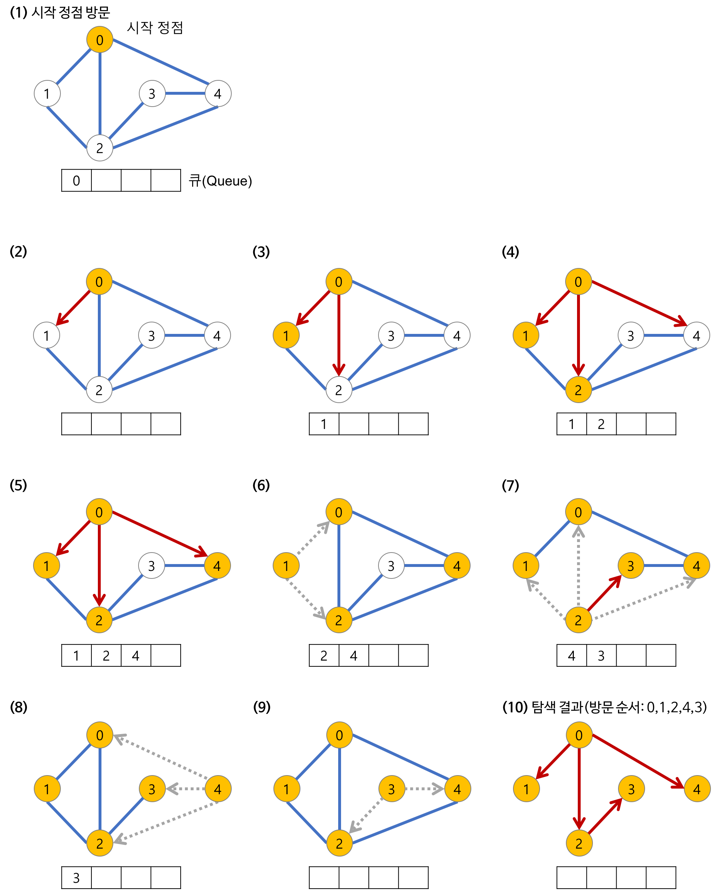

# BFS
## 너비 우선 탐색(Breadth-First Search)


> 그래프에서 **가장 가까운 노드부터 우선**적으로 탐색하는 알고리즘 <br>
> 큐 자료구조를 이용 <br>

<br><br>




<br><br><br>


## 💡 주요 속성
## 장점

- 출발노드에서 목표노드까지의 최단 길이 경로를 보장

## 단점
- 경로가 매우 길 경우에는 탐색 가지가 급격히 증가함에 따라 보다 많은 기억 공간을 필요로 함
- 해가 존재하지 않는다면 유한 그래프의 경우 모든 그래프를 탐색한 후에 실패로 끝난다.
- 무한 그래프의 경우에는 결코 해를 찾지도 못하고, 끝내지도 못한다.

<br><br><br>

## BFS를 구현한 부분
```python
from collections import deque

def bfs():
    queue = deque()
    queue.append(v)
    visited[v] = True
    while queue:
        temp = queue.popleft()
        for i in graph[temp]:
            if visited[i] == False:
                queue.append(i)
                visited[i] = True
```

## BFS를 사용하기 정말 좋았던 문제
[쉬운 최단거리](https://www.acmicpc.net/problem/14940)
```python
from collections import deque

dx = [0,0,-1,1]
dy = [1,-1,0,0]

n, m = map(int, input().split())

graph = []
visited = [[-1] * m for _ in range(n)]

for _ in range(n):
    graph.append(list(map(int, input().split())))

for i in range(n):
    for j in range(m):
        if graph[i][j] == 2:
            first_x,first_y = j, i

queue = deque()
queue.append([first_x, first_y])
visited[first_y][first_x] = 0

while queue:
    x, y = queue.popleft()
    for i in range(4):
        nx, ny = x + dx[i], y + dy[i]

        if nx >= m or nx < 0 or ny >= n or ny < 0:
            continue

        if visited[ny][nx] == -1 and graph[ny][nx] == 1:
            visited[ny][nx] = visited[y][x] + 1
            queue.append([nx,ny])

for i in range(n):
    for j in range(m):
        if graph[i][j] == 0:
            print(0, end = " ")
        else : 
            print(visited[i][j], end =" ")
    print()
```