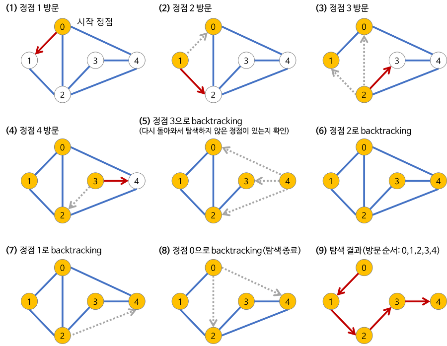

# DFS
## 깊이 우선 탐색(Depth-First Search)


> 그래프에서 루트 노드에서 시작해 다음 분기로 넘어가기 전에 해당 분기를 완전히 탐색하는 알고리즘 <br>
> 재귀 혹은 스택을 이용 <br>

<br><br>



<br><br><br>


## 💡 주요 속성
## 장점

- 현 경로상의 노드들만 기억하면 되므로 저장공간의 수요가 비교적 작음
- 목표노드가 깊은 단계에 있을 경우 해를 빨리 구할 수 있다.

## 단점
- 해가 없는 경로에 깊이 빠질 가능성이 있음.
- 얻어진 해가 최단 경로가 된다는 보장이 없음
<br><br><br>

## DFS를 구현한 부분
```python
# 스택을 이용한 방법
def dfs2():
    stack = []
    stack.append(v)
    visited3[v] = True
    while stack:
        temp = stack.pop()
        for i in graph[v]:
            if not visited3[i]:
                stack.append(i)
                visited3[i] = True

# 재귀를 통한 방법
def dfs(v):
    for i in graph[v]:
        if visited2[i] == False:
            visited2[i] = True
            dfs(i)
```