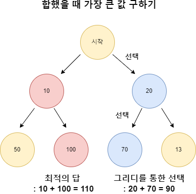
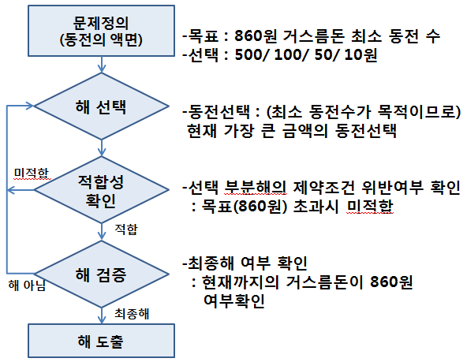

# 그리디 
# [문제](https://github.com/alstjr7437/baekjoon/tree/main/greedy)
## 현재 상황에서 지금 당장 좋은 것만 고르는 방법

> 현재 선택이 나중에 미칠 영향에 대해서는 고려하지 않음 <br>
> 항상 최적의 값을 보장하는것이 아니라 최적의 값의 ‘근사한 값’을 목표로 하고 있습니다.<br>
> 매 순간 가장 좋아 보이는 것을 선택 <br>

⭐️ 단순히 <b>현재 상황에서 가장 좋아 보이는 것만을 선택</b>해도 문제를 풀 수 있는지 파악할 수 있어야함
<br><br>




<br><br><br>


## 💡 주요 속성
#### 문제를 풀 때 두 가지 조건이 성립해야 그리디 알고리즘을 적용할 수 있음

### 탐욕 선택 속성
<b>각 단계에서 ‘최선의 선택’을 했을 때 전체 문제에 대한 최적해를 구할 수 있는 경우</b>를 말합니다. 즉, 각 단계에서 가장 이상적인 선택을 하는 것이 전체적으로 최적의 결과를 가져온다는 것입니다.

### 최적 부분 구조
<b>전체 문제의 최적해가 ‘부분 문제의 최적해로 구성’될 수 있는 경우</b>를 말합니다. 즉, 전체 문제를 작은 부분 문제로 나누어 각각의 부분 문제에서 최적의 해를 구한 후 이를 조합하여 전체 문제의 최적해를 구하는 것을 의미합니다.


<br><br><br>


## 💡 그리디 알고리즘의 단계
1. 문제의 최적해 구조 결정

2. 문제의 구조에 맞게 선택 절차를 정의 : 선택 절차(Selection Procedure)
    - '현재 상태'에서 '최적인 선택'을 함

3. 선택 절차에 따라 선택을 수행

4. 선택된 해가 문제의 조건을 만족하는지 검사 : 적절성 검사(Feasibility Check)
    - '선택한 항목'이 '문제의 조건을 만족'하는지 확인

5. 조건을 만족하지 않으면 해당 해를 제외

6. 모든 선택이 완료되면 해답을 검사 : 해답 검사(Solution Check)
    - '최종 선택'이 '문제의 조건을 만족'시키는지 확인

7. 조건을 만족하지 않으면 해답으로 인정되지 않음


<br><br><br><br>


# 💡 예제1 : [거스름돈](https://www.acmicpc.net/problem/14916)
손님에게 거슬러 줘야 할 돈이 N원일 때 거슬러 줘야 할 동전의 최소 개수를 구하라.

'가장 큰 화폐 단위부터' 돈을 거슬러 주는 것


<br><br>


> 예) 1260원을 거슬러줘야 한다고 하면<br>

| 500 | 100 | 50 | 10 | 합계 |
|:---:|:---:|:---:|:---:|:---:|
| 0 | 0 | 0 | 0 | 0 | 
| 2 | 0 | 0 | 0 | 1000 |
| 2 | 2 | 0 | 0 | 1200 |
| 2 | 2 | 1 | 0 | 1250 | 
| 2 | 2 | 1 | 1 | 1260 |

<br>


<br><br>

## 위와 같이 되는 이유 
가지고 있는 동전 중에서 **가장 큰 단위가 항상 작은 단위의 배수**이므로 작은 단위의 **동전들을 종합해 다른 해가 나올 수 없기** 때문

### -> 화폐 단위가 500, 400, 100일 경우 800원이 들어오면

400 + 400이 최적의 해지만 그리디로 가게 되면 500 100 100 100이 되게 된다


<br><br><br><br>


# 💡 예제2 : 큰 수의 법칙
N개의 수가 주어지고 그 수를 이용하여 M개의 수에서 제일 큰수 만들기 대신 K번 연속하면 안됨

> N : 5 M : 8 K : 3<br>
수 : 2, 4, 5, 4, 6<br>
답 : 6 + 6 + 6 + 5 + 6 + 6 + 6 + 5 = 46

> N : 5 M : 7 K : 2<br>
수 : 3, 4, 3, 4, 3<br>
답 : 4 + 4 + 4 + 4 + 4 + 4 + 4 = 28


<br><br>


## 해결 방식
연속된 수가 아니면 되는거니 제일 큰수와 두번째로 큰수를 빼둔다.

가장 큰 수 : 6 두번째 : 5

6 + 6 + 6 + 5 / 6 + 6 + 6 + 5가 된다
반복되는 수열은 K + 1

따라서 M을 (K+1)로 나눈 몫이 반복 횟수
```python
count = int(m / (k + 1)) * k
count += m % (k+1)

result += count * first
result += (m-count) * second
```