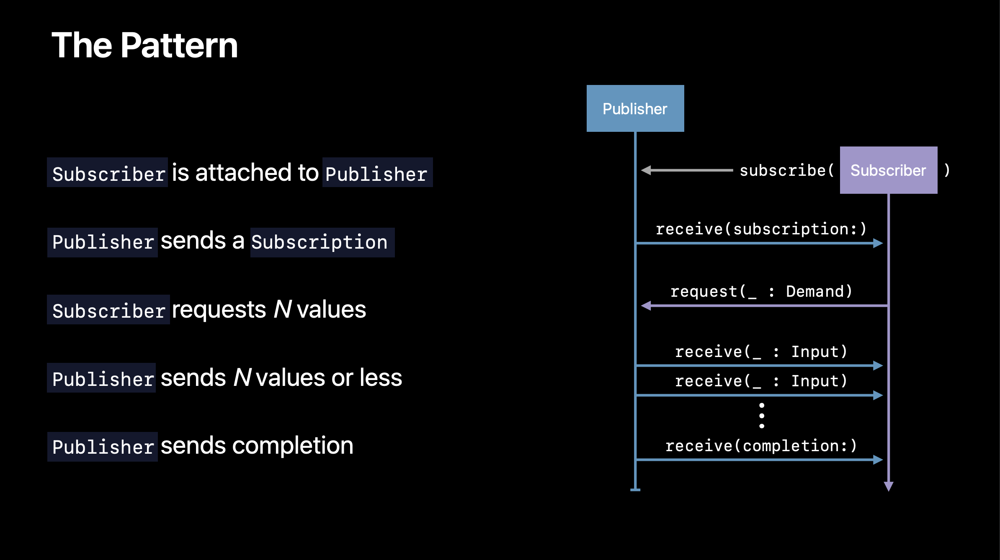
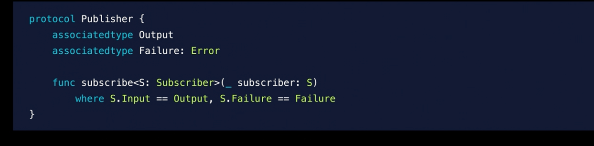
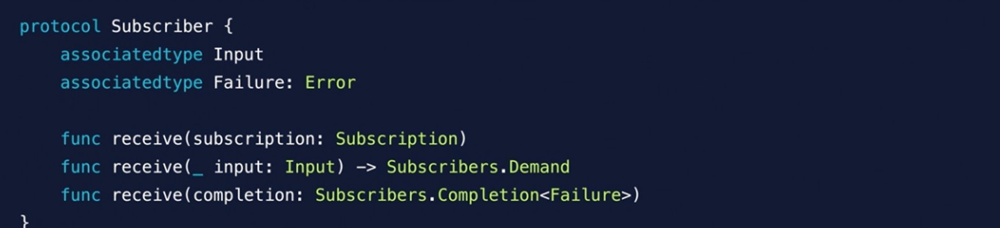
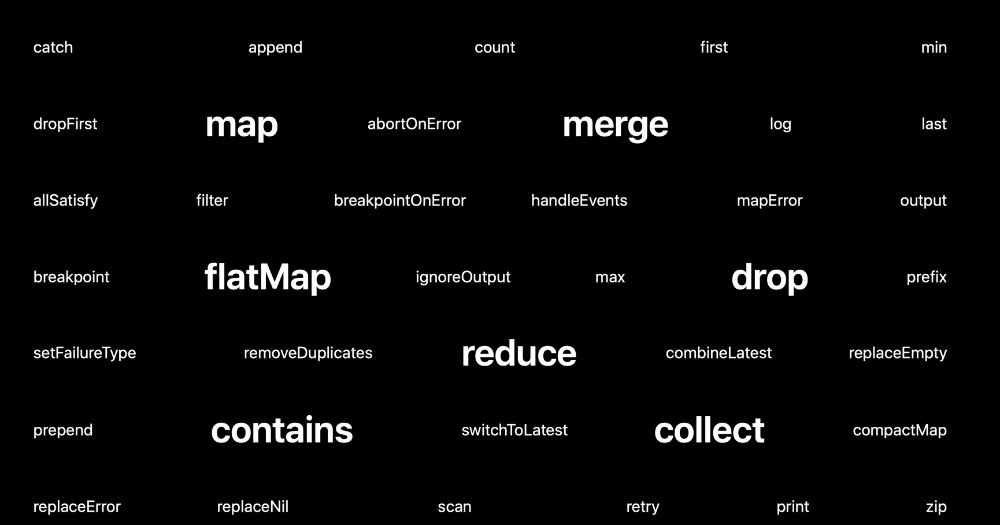
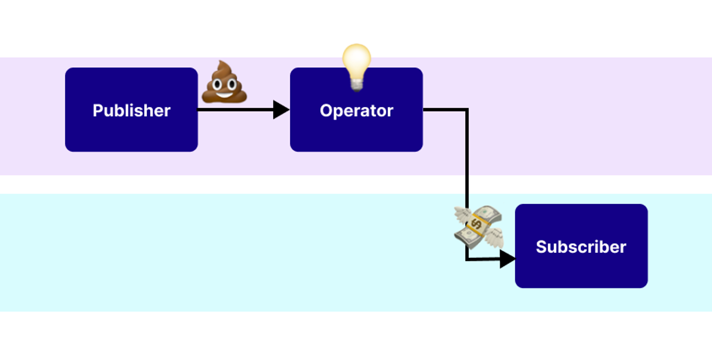

# Combine
- [Publisher](#publisher)
- [subscriber](#subscriber)
- [Subscription](#subscription)

---

- [Subject](#subjectpublisher)
- [Published](#publishedpublisher)
- [Operator](#operator)
- [Scheduler](#scheduler)
    - [2가지 메소드](#2가지-scheduler-메소드)
    - [패턴](#pattern)

## 💡 Combine
> 이벤트 처리 연산자들을 통해 **비동기 이벤트들을 핸들링** 할 수 있게 하는 것

## 💡 Async


동기 : **요청과 그 결과가 동시에**
- 바로 요청을 하면 시간이 얼마나 걸리던지 요청한 자리에서 결과가 주어져야 함.
- 순서에 맞춰 진행되는 장점이 있지만, 여러 가지 요청을 동시에 처리할 수 없음.

비동기 : 요청과 그 결과가 동시가 아님
- 하나의 요청에 따른 응답을 즉시 처리하지 않아도, 그 **대기 시간동안 또 다른 요청에 대해 처리 가능**한 방식
- 여러 개의 요청을 동시에 처리할 수 있는 장점이 있지만 동기 방식보다 속도가 떨어질 수도 있음.

<br><br>

## 📜 Combine OverView

아래와 같이 그대로 줄 때도 있고

아래와 같이 Operator가 가공을 해서 줄 수 있음

<br>
Combine 주요 컴퍼넌트
- Publisher
    - 하나 혹은 여러개의 Subscriber 객체에 시간이 흐름에 따라 값을 내보낼 수 있는 타입을 선언하기 위한 프로토콜
    - Output, Failure 타입이 제네릭으로 구현되어 있음.
    - 생산자, 배출자, 크리에이터, 배설자
- Subscriber
    - Publisher에게 값을 받을 수 있는 타입을 선언하기 위한 프로토콜
    - Input, Failure 타입이 제네릭으로 구현되어 있음.
    - 소비자, 구독자, 받는 사람
- Operator
    - Publisher를 반환하는 Publisher 프로토콜에 정의된 메서드들
    - Upstream, DownStream 이라는 Input, Output을 가지고 있음.
    - 변경시키는 사람, 마법사, 가공 하는 사람
- Subscription
    - Publisher와 Subscriber의 연결을 나타내는 프로토콜
    - Publisher + Operator + Subscriber로 이뤄진 하나의 작업이 Subscription

<br><br>


1. Subscriber가 Publisher에게 붙음
2. Publisher가 Subscriber에게 Subscription을 줌
3. Subscriber가 N개의 데이터가 필요하다고 요청함
4. Publisher가 N개의 데이터 또는 더 작게 보냄
5. Publisher가 종료

<br><br><br>

# Publisher

- **데이터를 배출**하는 친구
    - 구체적인 output 및 실패 타입 정의
    - Subscriber가 요청한것 만큼 데이터를 제공
- 빌트인 Publisher인 Just, Future가 있음
    - Just : 값을 다룸
    - Future : Function을 다룸
- iOS에서는 자동으로 제공해주는 녀석들이 있음
    - NotificationCenter
    - Timer
    - URLSession.dataTask

<br><br><br>

# SubScriber

- **Publisher에게 데이터 요청**함
- Input, Failure 타입 정의
- Publisher 구독후, 갯수를 요청함
- 파이프라인을 취소할 수 있음.
- 빌트인 Subscriber인 assign과 sink가 있음
    - assign : Publisher가 제공한 데이터를 특정 객체의 키패스에 할당
    - sink : Publisher가 제공한 데이터를 받을 수 있는 클로져를 제공

<br><br><br>

# Subscription
- **Subscriber가 Publisher가 연결**됨을 나타내는 녀석
    - 쉽게 생각하면 Publisher가 발행한 구독 티켓
    - 이 티켓만 있으면 데이터를 받을 수 있음
    - 이 티켓이 사라지면 구독 관계도 사라짐
- Cancellable protocol을 따르고 있음
    - 따라서, Subscription을 통해 **연결을 Cancel** 할 수 있음.

<br><br><br>

# Subject(Publisher)
- **send(_:)** 메소드를 이용해서 이벤트 값을 주입시킬 수 있는 퍼블리셔
- 기존의 비동기처리 방식에서 Combine으로 전환시 유용
- 2가지 빌트인 타입
    - PassthroughSubject
        - Subcriber가 달라고 요청하면
        - 그때 부터, 받은 값을 전달해주기만 함.
        - 전달한 값을 들고 있지 않음.
    - CurrentValueSubject
        - Subcriber가 달라고 요청하면
        - 최근에 가지고 있던 값을 전달하고, 그때 부터, 받은 값을 전달 함
        - 전달한 값을 가지고 있음.

<br><br><br>

# Published(Publisher)
- **@Publisher** 로 선언된 프로퍼티를 퍼블리셔로 만들어줌.
- 클래스에 한해서 사용됨.(구조체에서 사용 안됨)
- **$** 를 이용해서 퍼블리셔에 접근할 수 있음.

```swift
class Weather {
    @Published var temperature: Double
    init(temperature: Double) {
        self.temperature = temperature
    }
}

let weather = Weather(temperature: 20)
let subscription = weather.$temperature.sink {
    print ("Temperature now: \($0)")
}
weather.temperature = 25

// Temperature now: 20.0
// Temperature now: 25.0
```

<br><br><br>

# Operator 
- Publisher에게 받은 값을 가공해서 Subscriber에게 제공
- Input, Output, Failure type을 받는데 타입이 다를 수 있음.
- 빌트인 오퍼레이터가 많이 있음.
    - map, filter, reduce, collect, ...


<br><br><br>

# Scheduler
- Scheduler는 언제 어떻게 클로져를 실행할지 정해주는 녀석
- Operator에서 Scheduler를 파라미터로 받을때가 있음.
    - 따라서, 작업에 따라서, 백그라운드 혹은 메인스레드에서 작업이 실행될 수 있게 도와줌
- Scheduler가 스레드 자체는 아님.

<br>

## 2가지 Scheduler 메소드
**subscribe(on:)** 을 이용해서, publisher가 어느 스레드에서 수행할지 결정해주는 것
- 무거운 작업은 메인스레드가 아닌 다른 스레드에서 작업할 수 있게 도와줌.
    - 예) 백그라운드 계산이 많이 필요한 것
    - 예) 파일 다운로드 해야하는 경우
- **receive(on:)** 을 이용해서 operator, subscriber가 어느 스레드에서 수행할지 결정해주는 것
    - Ui 업데이트 필요한 데이터를 메인 스레드에서 받을 수 있게 도와줌
    - 예) 서버에서 가져온 데이터를 Ui업데이트 할때

<br>

## Pattern
일반적인 패턴
```swift
let jsonPublisher = MyJSONLoaderPublisher() // Some publisher.

jsonPublisher
    .subscribe(on: backgroundQueue)
    .receive(on: RunLoop.main)
    .sink { value in
		label.text = value
}
```


UI 업데이트 시
- 올바르지 못한 방법
**receive(on:)**을 안쓰면 아래와 같이 되지만 apple에서는 추천 안함
```swift
pub.sink {
    DispatchQueue.main.async {
        // Do update ui
    }
}
```
- 올바른 방법
```swift
pub.receive(on: DispatchQueue.main).sink {
        // Do update ui
}
```

# ⚠️ 참고
[동기 비동기](https://dev-coco.tistory.com/46) 개념 <br>
[Combine 주요 구성 요소](https://icksw.tistory.com/271)<br>
[WWDC combine 소개](https://developer.apple.com/videos/play/wwdc2019/722/) <br>
[WWDC combine 연습](https://developer.apple.com/videos/play/wwdc2019/721/)<br>
