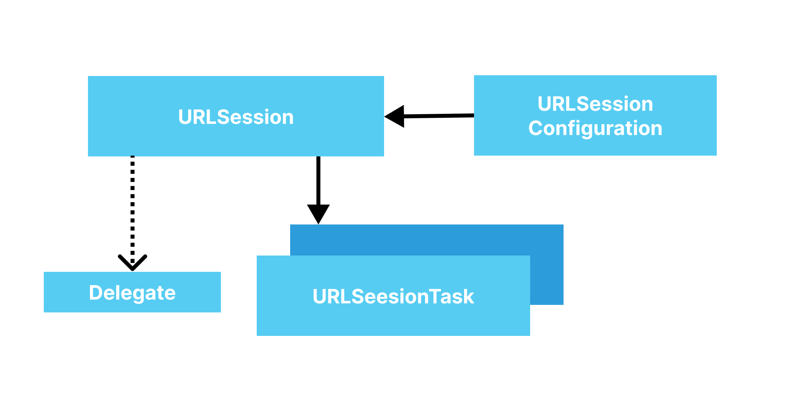

# URLSession 
- [URLSession](#urlsession)
    - [실습](#urlsession-실습)
    - [실습 결과](#urlsession-실습-결과)
- [Codable](#codable)
    - [실습](#codable-실습)
    - [결과](#codable-실습-결과)
- [Method로 실습](#method를-만들어서-username-받은-부분을-검색하도록-실습)
    -[결과](#method-결과-부분)
- [URLSession + Combine](#urlsession--combine)
    - [실습](#urlsession--combine-실습)
    - [결과](#urlsession--combine-결과)
- [참고](#⚠️-참고)

<br><br><br><br><br><br><br><br>

# URLSession
> Swift에서 URLSession을 이용해서 서버와 소통

- URLSessionConfiguration
    - .default 
        - 디스크를 이용한 정보 저장을 하는 configuration
        - 그냥 **브라우저 띄울때**
    - .ephemeral 
        - default랑 비슷한데, **몇가지 정보들을 저장하지 않음**(쿠키, 인증서 등)
        - 브라우저 **시크릿 모드**라고 생각하면 쉬움
    - .background
        - 네트워크를 통해 파일 다운로드 받을때
        - 앱이 **백그라운드에서 돌때**도, **다운로드** 시켜줄 수 있음(게임 업데이트 할떄 등?)
- URLSession
    - configuration을 보고 **세션을 생성**
- URLSessionTask
    - dataTask
    - uploadTask
    - downloadTask




<br><br><br><br><br>

## URLSession 실습
```swift
import Foundation

// Configuration -> URLsession -> URLSessionTask

// Configuration 
let configuration = URLSessionConfiguration.default

// URLSession
let session = URLSession(configuration: configuration)

let url = URL(string: "https://api.github.com/users/alstjr7437")!

// URLSessionTask
let task = session.dataTask(with: url) { data, response, error in
    guard let httpResponse = response as? HTTPURLResponse,
          (200..<300).contains(httpResponse.statusCode) else {
        print("--> response\(response)")
        return
    }
    
    guard let data = data else { return }
    
    let result = String(data: data, encoding: .utf8)
    print(result)
}

task.resume()
```
위와 같이 하여서 Github api를 사용하면

<br><br><br><br>

## URLSession 실습 결과
아래와 같이 **JSON 형태로 데이터**를 받아옴
```
Optional("{\"login\":\"alstjr7437\",\"id\":94051599,\"node_id\":\"U_kgDOBZsdDw\", ~~~})
```

실패시(404에러 등등 여러가지 Http 응답 코드 반환)
```
--> responseOptional(<NSHTTPURLResponse: 0x6000002223c0> { URL: https://api.github.com/users/alstjr7437sad } { Status Code: 404, Headers {
```

<br><br><br><br><br><br><br><br>

# [Codable](https://developer.apple.com/documentation/swift/codable)
- swift 객체를 **외부 데이터 형태(주로 JSON)로 인코딩, 디코딩** 가능하게 해주는 타입
- 네트워크 응답형태로 JSON이 거의 표준으로 사용
- Codable을 이용하면, **JSON과 swift 객체간 전환**이 매우 쉬움

<br><br><br><br>

## Codable 실습
아까 [URLSession](#urlsession-실습)에서 실습한 코드의 결과는 [JSON](#urlsession-실습-결과) 형태였는데 그걸 Codable을 이용해서 swift 객체에 맞게 변경

우선 가지고 올 구조체 선언
```swift
// JSON -> App model 
struct GithubProfile: Codable {
    let login: String
    let avatarUrl: String
    let htmlUrl: String
    let followers: Int
    let following: Int
    
    // json key값을 아래 CodingKeys로
    // 언더바가 있으면 아래와 같이 넣어주기
    enum CodingKeys: String, CodingKey {
        case login
        case avatarUrl = "avatar_url"
        case htmlUrl = "html_url"
        case followers
        case following
    }
}
```
avatar_url은 api에서 가져온 **스네이크 케이스**
하지만 **swift에서는 카멜 케이스**를 쓰기 때문에 위와 같이 CodingKeys를 수정해줬음.

<br><br>

이제 URLSession에서 실습한 것과 같이 진행하지만 do부분을 이용해 JSONDecoder해서<br>
profile이라는 구조체에 넣어주기<br>
그리고 성공시 profile 출력<br>
실패시 error 출력<br>

```swift
let configuration = URLSessionConfiguration.default
let session = URLSession(configuration: configuration)

let url = URL(string: "https://api.github.com/users/alstjr7437")!

let task = session.dataTask(with: url) { data, response, error in
    guard let httpResponse = response as? HTTPURLResponse,
          (200..<300).contains(httpResponse.statusCode) else {
        print("--> response\(response)")
        return
    }
    
    guard let data = data else { return }
    // data -> GithubProfiledo 
    
    do {
        let decoder = JSONDecoder()
        let profile = try decoder.decode(GithubProfile.self, from: data)
        print("profile: \(profile)")
    } catch let error as NSError{
        print("[error] : \(error)")
    }
}

task.resume()
```

<br><br><br><br>

## Codable 실습 결과
성공시 JSON이 decode되어서 <br>
profile로 만들어지게 됨<br>
아래와 같이 login등등이 들어간 부분 확인 가능
```
profile: GithubProfile(login: "alstjr7437", avatarUrl: "https://avatars.githubusercontent.com/u/94051599?v=4", htmlUrl: "https://github.com/alstjr7437", followers: 29, following: 27)
```

<br><br><br><br><br><br><br><br>

# Method를 만들어서 userName 받은 부분을 검색하도록 실습
Codable은 위와 같고 URL 부분을 class와 함수로 만들어 줌

[@escaping](https://babbab2.tistory.com/164) 관련 공부 블로그
```swift
final class NetworkService {
    let session: URLSession
    
    init(configuration: URLSessionConfiguration){
        session = URLSession(configuration: configuration)
    }
    
    // Result는 enum 타입 성공 케이스, 실패 케이스 있음
    func fetchProfile(userName: String, completion: @escaping (Result<GithubProfile, Error>)-> Void){
        let url = URL(string: "https://api.github.com/users/\(userName)")!

        let task = session.dataTask(with: url) { data, response, error in
            
            // 1. error 출력 부분
            if let error = error{
                completion(.failure(NetworkError.transportError(error)))
                return
            }
            
            // 2. 200대가 아니면 에러 출력 부분
            if let httpResponse = response as? HTTPURLResponse, !(200..<300).contains(httpResponse.statusCode) {
                completion(.failure(NetworkError.responseError(statusCode: httpResponse.statusCode)))
                return
            }
            
            // 3. data 받았는데 데이터 없으면
            guard let data = data else {
                completion(.failure(NetworkError.noData))
                return
            }

            // data -> GithubProfile
            do {
                let decoder = JSONDecoder()
                let profile = try decoder.decode(GithubProfile.self, from: data)
                completion(.success(profile))
            } catch let error as NSError{
                // 4. Decoding 중 에러
                completion(.failure(NetworkError.decodingError(error)))
            }
        }
        task.resume()
    }
}

// NetworkService 실행 부분
let networkService = NetworkService(configuration: .default)

networkService.fetchProfile(userName: "alstjr7437") { result in
    switch result {
    case .success(let profile):
        print("Profile: \(profile)")
    case .failure(let error):
        print("Error: \(error)")
    }
}
```

<br><br><br><br>

## Method 결과 부분

1. 정상 결과
```
Profile: GithubProfile(login: "alstjr7437", avatarUrl: "https://avatars.githubusercontent.com/u/94051599?v=4", htmlUrl: "https://github.com/alstjr7437", followers: 29, following: 27)
```

<br><br>

2. 2번에서 404로 들어와서 에러 출력
```
userName: "alstjr7437dsad"
위와 같이 바꿔서

> Error: responseError(statusCode: 404)
```

<br><br>

3. 4번에서 Decoding을 하려는데 일치하는 부분이 없을때 에러
```
case avatarUrl = "avatar_urldsd"
위와 같이 바꿔서

> Error: decodingError(Swift.DecodingError.keyNotFound(CodingKeys(stringValue: "avatar_urldsd", intValue: nil), Swift.DecodingError.Context(codingPath: [], debugDescription: "No value associated with key CodingKeys(stringValue: \"avatar_urldsd\", intValue: nil) (\"avatar_urldsd\").", underlyingError: nil)))
```

<br><br>


이렇게 위와 같이 함수로 바꿔서 훨씬 에러코드도 깔끔해지고 보기 좋아짐<br>
그리고 userName도 함수로 바로 넘겨줘서 해당 부분을 쓰는걸 확인 가능

<br><br><br><br><br><br><br><br>

# URLSession + Combine
- URLSessionDataTask에 대해서 publisher 제공
    - 따라서, 비동기 응답에 대한 작업이 더 수월함

<br><br><br><br>

## URLSession + Combine 실습
아까와 똑같이 Codable은 똑같음<br>
하지만 Error부분을 enum을 통해 선언

```swift
enum NetworkError: Error {
    case invalidRequest
    case responseError(statusCode: Int)
}
```
<br><br>

그리고 NetworkService를 만듬
```swift

final class NetworkService {
    let session: URLSession
    
    init(configuration: URLSessionConfiguration){
        session = URLSession(configuration: configuration)
    }
    
    // Result는 enum 타입 성공 케이스, 실패 케이스 있음
    func fetchProfile(userName: String) -> AnyPublisher<GithubProfile, Error> {
        let url = URL(string: "https://api.github.com/users/\(userName)")!
        
        return session
            // dataTask 퍼블리셔 만들기
            .dataTaskPublisher(for: url)
            // 서버에서 받은 Data, response 확인
            .tryMap { result -> Data in
                guard let httpResponse = result.response as? HTTPURLResponse, (200..<300).contains(httpResponse.statusCode) else {
                    let response = result.response as? HTTPURLResponse
                    let statusCode = response?.statusCode ?? -1
                    throw NetworkError.responseError(statusCode: statusCode)
                }
                return result.data
            }
            // 받은 Data 디코딩하기
            // Operator 중에 decode해주는게 있음
            .decode(type: GithubProfile.self, decoder: JSONDecoder())
            .eraseToAnyPublisher()
    }
}
```

<br><br>

위에 만들어진 Class를 이용해서 Subscription 만들기
```swift
let subscription = networkService
    .fetchProfile(userName: "alstjr7437")
    .receive(on: RunLoop.main)
    .print()
    .sink { error in
        print("error: \(error)")
    } receiveValue: { profile in
        print("profile: \(profile)")
    }
```

<br><br><br><br><br><br>

## URLSession + Combine 실습 결과

### 1. 성공 결과
```
receive subscription: (ReceiveOn)
request unlimited
receive value: (GithubProfile(login: "alstjr7437", avatarUrl: "https://avatars.githubusercontent.com/u/94051599?v=4", htmlUrl: "https://github.com/alstjr7437", followers: 29, following: 27))
profile: GithubProfile(login: "alstjr7437", avatarUrl: "https://avatars.githubusercontent.com/u/94051599?v=4", htmlUrl: "https://github.com/alstjr7437", followers: 29, following: 27)
receive finished
```

<br><br><br>

### 2. URL을 잘못 입력할시 에러
```
receive subscription: (ReceiveOn)
request unlimited
receive error: (responseError(statusCode: 404))
error: failure(__lldb_expr_158.NetworkError.responseError(statusCode: 404))
```

<br><br><br>

### 3. Data Decode 에러
```
receive subscription: (ReceiveOn)
request unlimited
receive error: (keyNotFound(CodingKeys(stringValue: "avatar_urlds", intValue: nil), Swift.DecodingError.Context(codingPath: [], debugDescription: "No value associated with key CodingKeys(stringValue: \"avatar_urlds\", intValue: nil) (\"avatar_urlds\").", underlyingError: nil)))
error: failure(Swift.DecodingError.keyNotFound(CodingKeys(stringValue: "avatar_urlds", intValue: nil), Swift.DecodingError.Context(codingPath: [], debugDescription: "No value associated with key CodingKeys(stringValue: \"avatar_urlds\", intValue: nil) (\"avatar_urlds\").", underlyingError: nil)))
```

<br><br><br>

### 4. Combine에서 retry넣기<br>
retry 넣어서 실패해도 3번 시도 해봐라 
```swift
let subscription = networkService
    .fetchProfile(userName: "alstjr7437f")
    .receive(on: RunLoop.main)
    .print()
    .retry(3)
    .sink { error in
        print("completion: \(error)")
    } receiveValue: { profile in
        print("profile: \(profile)")
    }
```
```
receive subscription: (ReceiveOn)
request unlimited
receive error: (responseError(statusCode: 404))
receive subscription: (ReceiveOn)
request unlimited
receive error: (responseError(statusCode: 404))
receive subscription: (ReceiveOn)
request unlimited
receive error: (responseError(statusCode: 404))
receive subscription: (ReceiveOn)
request unlimited
receive error: (responseError(statusCode: 404))
completion: failure(__lldb_expr_174.NetworkError.responseError(statusCode: 404))
```

<br><br><br><br><br><br><br><br>

# ⚠️ 참고
[Codable](https://developer.apple.com/documentation/swift/codable)<br>
[URLSession](https://developer.apple.com/documentation/foundation/urlsession)<br>
[URLSession + Combine](https://velog.io/@yy0867/Swift-%EC%A0%95%EB%A6%AC-URLSession-Combine)<br>
