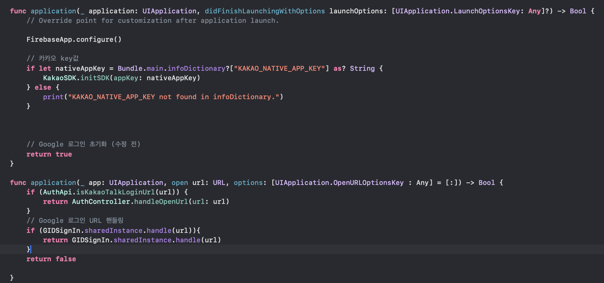

# FireBase 연동

## 파이어베이스 프로젝트 설정 

### 앱 등록
     

번들 ID : Project > Targets > Signing & Capabillities > Bundle Identifier

--- 

### 구성 파일을 다운로드 후 프로젝트 파일에 넣기
     

     

---
### FireBase SDK 추가
     

1. Project > Package Dependencies > +
 
2. URL 부분에 위 사진에 2번을 복사해서 붙여넣고 Add Package

3. 다운로드 중 라이브러리 선택 시 FirebaseAnalytics, FirebaseAnalyticsWithoutAdId 등 추가

---
### 초기화 코드 추가
    
 
1. Project 파일에 AppDelegate 이동

2. import FireBaseCore 추가(에러가 나면 Package가 안들고 와진거)
3. 위 사진에서 didFinish부분에는 FirebaseApp.configure() 추가

## 결과 확인

위 사진과 같이 사용자가 늘어나면 연동 성공!