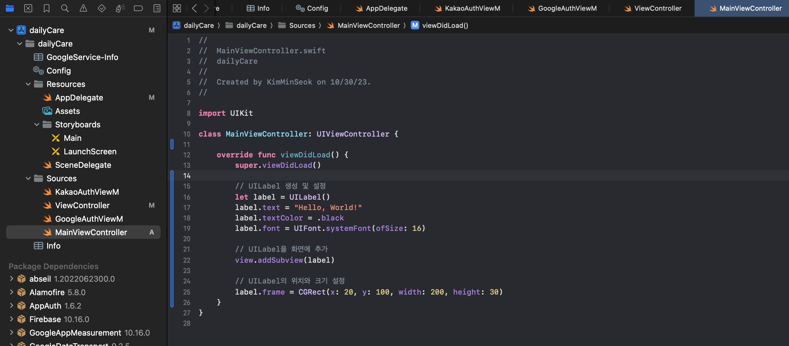
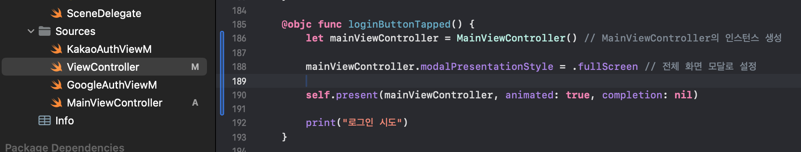
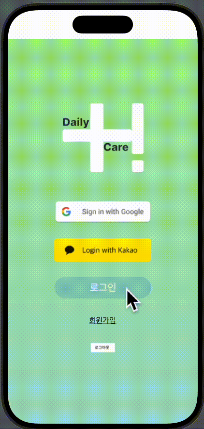

# 화면 전환(present 방식)

## present 방식에 대한 이해
> ### present : 이동
> >modally : 뷰 위에 뷰가 한겹 올라간 구조 </br>
> 세로방향으로 전개(아래에서 위)</br>
> 사용하는곳 : alert 알람, 새로운 이메일 작성하기</br>
> modalPresentationStyle로 화면 전환이 되는 스타일을 정할 수 있음

```Swift
let 이동할뷰컨 = self.storyboard?.instantiateViewController(withIdentifier: "뷰컨아이디") else {return}
        
self.present(이동할뷰컨, animated: true, completion: nil)
```
### present 함수 매게변수 부분
viewControllerPresent : 현재의 뷰컨 내용 위에 보여지는 뷰컨</br>
flag : 애니메이션 여부</br>
completion : 이동이 끝난 후 실행될 블록 =nil (리턴값, 파라미터 없음)

### present인데 화면을 채우고 싶을때
```Swift
이동할뷰컨.modalPresentationStyle = .fullScreen
```

## dismiss 대한 이해 : 돌아가기
> 뷰컨을 네비게이션으로 부터 pop하고 화면 업데이트
```Swift
self.presentingViewController?.dismiss(animated: true)
```

### dismiss 함수 매게변수 부분
animated : 애니메이션 여부

</br>
</br>

## UIKit에서 UI를 코드로 짜고 화면 전환

### 새로운 화면 생성
 

새로운 View Controller 만들기 
New File > Cocoa Touch class > UIViewController > Class에 본인이 원하는 폴더 명

--- 

### 원래의 ViewControlle파일에 present 방식으로 화면 이동 넣기
     
code에서 let mainViewController로 MainView를 호출 </br>
fullscreen을 줘서 전체 화면을 채우게 함

--- 
# dismiss 사용 예제 추가 예정..