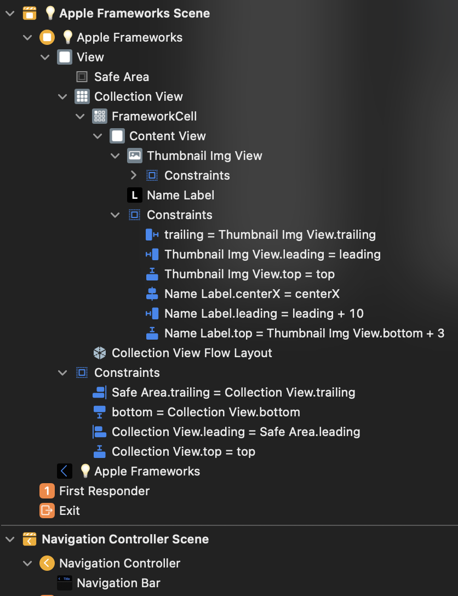
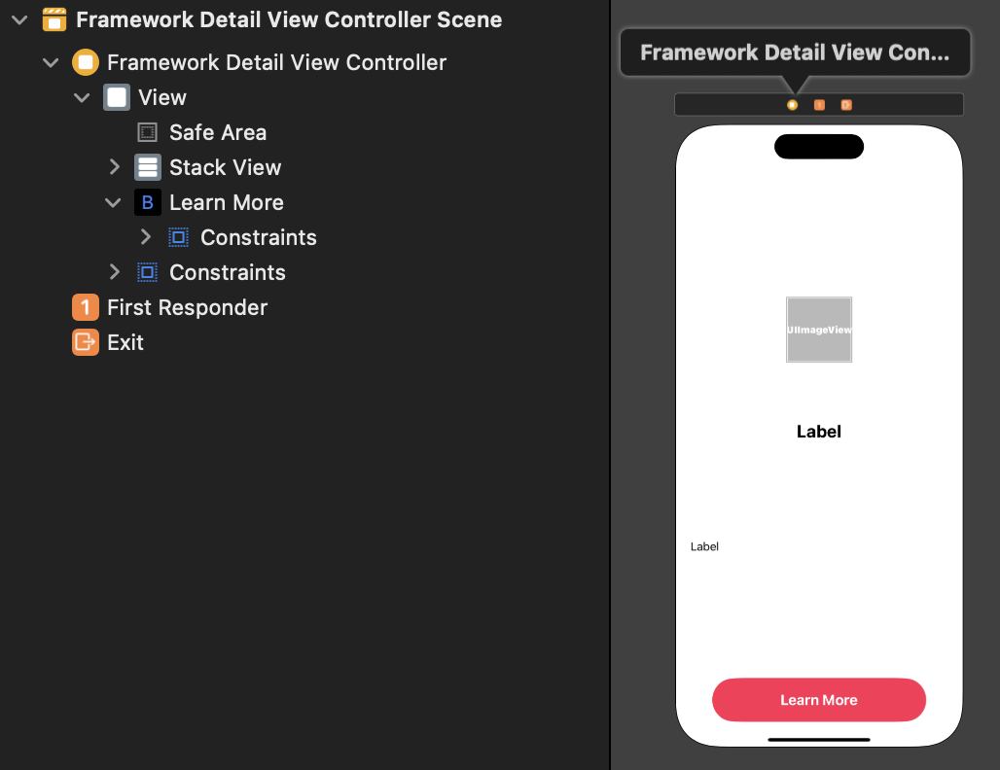

# AppleFramework 프로젝트
# 사용 기술
- StoryBoard 
    - CollectionView 사용
    - Auto Layout 설정
    - Navigation 설정

- ViewController
    - CollectionView : DataSource, Delegate 사용(self로 extension 사용)
    - flowlayout : size automatic 풀어주기
    - extension DataSource : 데이터 셋팅(casting 사용)
    - extension DelegateFlowLayout
        - sizeForItemAt를 이용해 CGSize 설정(한줄 갯수 설정 등)
        - [셀 사이 간격 조절](https://k-elon.tistory.com/26)
            - minimumInteritemSpacingForSectionAt : 셀 사이 최소 간격 반환
            - minimumLineSpacingForSectionAt : 행 사이 최소 간격 반환
    - extension UICalendarViewDelegate : 클릭시 동작 이벤트 처리

- CollectionViewCell
    - configure : 데이터 셋팅
    - awakefromnib : StoryBoard 생성시 Layout 등 꾸며주는 함수

<br><br>

# 사용 기술 추가
- Diffable DataSource
- Compositional Layout
- Present 화면 변경
- SafariServices 프레임워크 사용

<br><br>

 

0. AppleFramework 구조체 및 assets 파일 가져오기
    - name, imageName, urlString, description
    - assets에 있는 Framework 이미지들 들고오기
1. UI 만들기
    - Collection View
        - FrameworkCell
            - ContentView
                - ThumbnailImgView - 프레임워크 사진
                - Label - 이름
2. CollectionView 연결
    - Data -> 어떤 데이터?
    - Presentation -> 셀을 어떻게 표현?
    - Layout -> 셀을 어떻게 배치?
3. CollectionView 데이터 업로드
    - UIComponent 연결
    - UIComponent 데이터 업로드 코드 작성
4. 짜잘한 UI 코드 수정
    - 네비게이션바 만들기
    - cell 부분 클릭시 동작 이벤트
    - 2개, 3개, 4개 띄우기
    - code로 view size 설정

<br><br><br>

# UI 만들기(StoryBoard)
1. Collection View 만들기
2. Collection View안에 Cell 만들기(복사될)
3. Label 및 여러가지 필요한 UI 넣기
4. 각 UI에 맞는 AutoLayout 설정
    - ctrl으로 상위의 UI에 연결해서 위 맞추기 등

## 최종 결과 StoryBoard


<br><br><br>

# FrameworkListViewController 작성 
## 1. collectionView 가져오기
```Swift
@IBOutlet weak var collectionView: UICollectionView!
```

## 2. 데이터 구조체 가져오기
```Swift
let list: [AppleFramework] = AppleFramework.list
```

## 3. viewDidLoad 코드
```Swift
override func viewDidLoad() {
    super.viewDidLoad()

    collectionView.dataSource = self
    collectionView.delegate = self
    
    // 네비게이션 title 설정
    navigationController?.navigationBar.topItem?.title = "☀️ Apple Frameworks"
    
    // 의도한 사이즈대로 하려면
    // 빼보면 이상해짐
    // 아니면 collectionView에서 size를 automatic을 풀어줌(컴퓨터가 자동으로 사이즈 계산해서 넣어주기 때문)
    if let flowlayout = collectionView.collectionViewLayout as? UICollectionViewFlowLayout {
        flowlayout.estimatedItemSize = .zero
    }
    
    // collectionView 위 20 왼쪽, 오른쪽 16의 공간 주기
    collectionView.contentInset = UIEdgeInsets(top: 20, left: 16, bottom: 0, right: 16)
}
```

## 4. DataSource extension 작성
데이터 처리해서 넣어주는 부분
```Swift
extension FrameworkListViewController: UICollectionViewDataSource{
    // list 갯수만큼 가져와서 데이터 넣어주기
    func collectionView(_ collectionView: UICollectionView, numberOfItemsInSection section: Int) -> Int {
        return list.count
    }
    
    // FrameworkCell 만들어주기
    func collectionView(_ collectionView: UICollectionView, cellForItemAt indexPath: IndexPath) -> UICollectionViewCell {
        guard let cell = collectionView.dequeueReusableCell(withReuseIdentifier: "FrameworkCell", for: indexPath) as? FrameworkCell else {
            return UICollectionViewCell()
        }
        let framework = list[indexPath.item]
        cell.configure(framework)
        return cell
    }
}
```

## 5. DelegateFlowLayout extension 작성
CollectionView Cell 크기 수정
```Swift
extension FrameworkListViewController: UICollectionViewDelegateFlowLayout{
    func collectionView(_ collectionView: UICollectionView, layout collectionViewLayout: UICollectionViewLayout, sizeForItemAt indexPath: IndexPath) -> CGSize {
        
        // 여백 주기(3열)
        let interItemSpacing: CGFloat = 10
        let padding: CGFloat = 16
        let width = (collectionView.bounds.width - interItemSpacing * 2 - padding * 2) / 3
        let height = width * 1.5
        return CGSize(width: width, height: height)

    }
    
    //지정된 섹션의 셀 사이의 최소간격을 반환하는 메서드.
    func collectionView(_ collectionView: UICollectionView, layout collectionViewLayout: UICollectionViewLayout, minimumInteritemSpacingForSectionAt section: Int) -> CGFloat {
        return 10
    }
    //지정된 섹션의 행 사이 간격 최소 간격을 반환하는 메서드. scrollDirection이 horizontal이면 수직이 행이 되고 vertical이면 수평이 행이 된다.
    func collectionView(_ collectionView: UICollectionView, layout collectionViewLayout: UICollectionViewLayout, minimumLineSpacingForSectionAt section: Int) -> CGFloat {
        return 10
    }
}
```

## 6. UICalendarViewDelegate extension 작성
셀의 각 부분 클릭시 동작 이벤트 작성
```Swift
extension FrameworkListViewController: UICalendarViewDelegate{
    func collectionView(_ collectionView: UICollectionView, didSelectItemAt indexPath: IndexPath) {
        // 각 indexPath의 item 클릭시 Print 출력
        let framework = list[indexPath.item]
        print("selected -> \(framework.name)")
    }
}
```

<br><br><br>

# FrameworkCell 작성
## 1. UIComponent 연결
1. Storyboard에서 CollectionViewCell에 가서 우측의 class및 Identifier 수정
2. 클릭하여 Assistant의 코드 부분을 AppleFrameworkCollectionViewCell로 변경
3. ctrl로 Label 및 ImgView 끌고오기
```Swift
@IBOutlet weak var thumbnailImgView: UIImageView!
@IBOutlet weak var nameLabel: UILabel!
```

## 2. UIComponent 데이터 업로드 코드 작성
함수를 만들어 데이터 업로드 코드 작성<br>
formattedDateString을 통해 날짜 형식 변환
```Swift
func configure(_ framework: AppleFramework){
    thumbnailImgView.image = UIImage(named: framework.imageName)
    nameLabel.text = framework.name
}
```

## 3. awakeFromNib 작성
storyboard 생성시 각 UI Style 작성
```Swift
override func awakeFromNib() {
    super.awakeFromNib()
    // 한줄로 변경
    nameLabel.numberOfLines = 1
    
    //폰트에 맞게 크기 변경
    nameLabel.adjustsFontSizeToFitWidth = true
}
```

<br><br><br>

# UI 짜잘한 추가 작업
## 1. 각 코드 별 한줄에 갯수
```Swift 
// 파일 : FrameworkCell.swift

// 3열일때 계산
let interItemSpacing: CGFloat = 10
let padding: CGFloat = 16
let width = (collectionView.bounds.width - interItemSpacing * 2 - padding * 2) / 3
let height = width * 1.5
return CGSize(width: width, height: height)

// 2열일때 계산
let width = (collectionView.bounds.width - interItemSpacing * 1 - padding * 2) / 2
let height = width * 1.5
return CGSize(width: width, height: height)

// 4열일때 계산
let interItemSpacing: CGFloat = 10
let padding: CGFloat = 16

let width = (collectionView.bounds.width - interItemSpacing * 3 - padding * 2) / 4
let height = width * 1.5
return CGSize(width: width, height: height)
}
```

## 2. viewDidLoad 부분에서 UI Style 건드려주기
Navigation의 Item 수정
```Swift
// 파일 : FrameworkListViewController.swift

navigationController?.navigationBar.topItem?.title = "☀️ Apple Frameworks"
if let flowlayout = collectionView.collectionViewLayout as? UICollectionViewFlowLayout {
    flowlayout.estimatedItemSize = .zero
}

// collectionView 위 20 왼쪽, 오른쪽 16의 공간 주기
collectionView.contentInset = UIEdgeInsets(top: 20, left: 16, bottom: 0, right: 16)
```

## 3. DelegateFlowLayuot에서 간격 건드려주기
각 셀들의 간격 주기
```Swift
// 파일 : FrameworkListViewController.swift

//지정된 섹션의 셀 사이의 최소간격을 반환하는 메서드.
func collectionView(_ collectionView: UICollectionView, layout collectionViewLayout: UICollectionViewLayout, minimumInteritemSpacingForSectionAt section: Int) -> CGFloat {
    return 10
}
//지정된 섹션의 행 사이 간격 최소 간격을 반환하는 메서드. scrollDirection이 horizontal이면 수직이 행이 되고 vertical이면 수평이 행이 된다.
func collectionView(_ collectionView: UICollectionView, layout collectionViewLayout: UICollectionViewLayout, minimumLineSpacingForSectionAt section: Int) -> CGFloat {
    return 10
}
```

<br><br><br>

# 추가 프로젝트 진행
## 1. DataSource -> Diffable DataSource
[StoryBoard](https://github.com/alstjr7437/IosFirstStudy/blob/main/AppleFramework_DiffableDatasource/AppleFramework_DiffableDatasource/Base.lproj/Main.storyboard)<br>
[ViewController](https://github.com/alstjr7437/IosFirstStudy/blob/main/AppleFramework_DiffableDatasource/AppleFramework_DiffableDatasource/FrameworkListViewController.swift)<br>
[CollectionViewCell](https://github.com/alstjr7437/IosFirstStudy/blob/main/AppleFramework_DiffableDatasource/AppleFramework_DiffableDatasource/FrameworkCell.swift)

## 2. Modality 
### Present를 통한 화면 전환!
## 1. 일단 화면과 UI 만들기(StoryBoard)



## 2. 동작할 부분의 ViewController 만들기
```swift
import UIKit
import SafariServices

class FrameworkDetailViewController: UIViewController {

    // 각 UI 들고오기
    @IBOutlet weak var imgView: UIImageView!
    @IBOutlet weak var titleLabel: UILabel!
    @IBOutlet weak var descriptionLabel: UILabel!

    // 데이터 셋팅
    var framework: AppleFramework = AppleFramework(name: "unknown", imageName: "", urlString: "", description: "")
    
    override func viewDidLoad() {
        super.viewDidLoad()
        updateUI()
        
    }
    
    // 데이터를 통한 UI 변경 함수
    func updateUI(){
        imgView.image = UIImage(named: framework.imageName)
        titleLabel.text = framework.name
        descriptionLabel.text = framework.description
    }
    
    // 버튼 클릭시 Safari Framework를 사용한 화면 띄어주기
    @IBAction func learnMoreTapped(_ sender: Any) {
        guard let url = URL(string: framework.urlString) else {
            return
        }
        
        let safari = SFSafariViewController(url: url)
        present(safari, animated: true)
    }    
}

```

## 3. 기존의 VC에서 present 방식으로 화면 전환 연결해주기
버튼 클릭시 동작하는 extension(didSelectItemAt) 부분에 present 방식의 화면 전환 코드 추가하기

```swift
//viewDidLoad에 추가
collectionView.delegate = self

extension FrameworkListViewController: UICollectionViewDelegate {
    func collectionView(_ collectionView: UICollectionView, didSelectItemAt indexPath: IndexPath) {
        let framework = list[indexPath.item]
        print(">>> selected: \(framework.name)")
        
        // 띄어야할 부분 : FrameworkDetailViewController
        let storyboard = UIStoryboard(name: "Detail", bundle: nil)
        let vc = storyboard.instantiateViewController(withIdentifier: "FrameworkDetailViewController") as! FrameworkDetailViewController
        // 데이터 넘겨주기
        vc.framework = framework
//        vc.modalPresentationStyle = .fullScreen
        present(vc, animated: true)
    }
}
```

# 💡 알아간 부분
1. CollectionViewCell을 들고오는 부분에서 처음에 이름을 잘못 넣어줬는데 거기서 Refactor을 해줬는데 추후에 문제가 생겨서 파일을 다시 만듬 -> 나중에 오류 찾기
2. StoryBoard에서 어느정도 AutoLayout만 맞추고 나머지 UI부분은 코드에서도 건드려 봤는데 협업하기 편해 보였음 -> 이러다 코드로 진화..?
3. DelegateFlowLayout의 함수에는 정말 많은게 있다
4. 첫 navigation

++ 

5. Diffable DataSource, Compositional Layout
6. Modality
7. Present 화면전환
8. storyBoard 더 만들어서 VC 연결 등
9. SafariServices 프레임워크 사용하여 Safari 화면 띄우기

# [전체 코드](https://github.com/alstjr7437/IosFirstStudy/tree/main/AppleFramework/AppleFramework)
[StoryBoard](https://github.com/alstjr7437/IosFirstStudy/blob/main/AppleFramework/AppleFramework/Base.lproj/Main.storyboard)<br>
[ViewController](https://github.com/alstjr7437/IosFirstStudy/blob/main/AppleFramework/AppleFramework/FrameworkListViewController.swift)<br>
[CollectionViewCell](https://github.com/alstjr7437/IosFirstStudy/blob/main/AppleFramework/AppleFramework/FrameworkCell.swift)

## [모달과 Diffable을 활용한 전체 코드](https://github.com/alstjr7437/IosFirstStudy/tree/main/AppleFramework_DiffableDatasource_2/AppleFramework)
[Main StoryBoard](https://github.com/alstjr7437/iOSFirstStudy/blob/main/AppleFramework_DiffableDatasource_2/AppleFramework/Base.lproj/Main.storyboard)<br>
[Detail StoryBoard](https://github.com/alstjr7437/IosFirstStudy/blob/main/AppleFramework_DiffableDatasource_2/AppleFramework/Detail.storyboard)<br>
[Main ViewController](https://github.com/alstjr7437/IosFirstStudy/blob/main/AppleFramework_DiffableDatasource_2/AppleFramework/FrameworkListViewController.swift)<br>
[CollectionViewCell](https://github.com/alstjr7437/IosFirstStudy/blob/main/AppleFramework_DiffableDatasource_2/AppleFramework/FrameworkCell.swift)<br>
[Detail ViewController](https://github.com/alstjr7437/IosFirstStudy/blob/main/AppleFramework_DiffableDatasource_2/AppleFramework/FrameworkDetailViewController.swift)<br>

