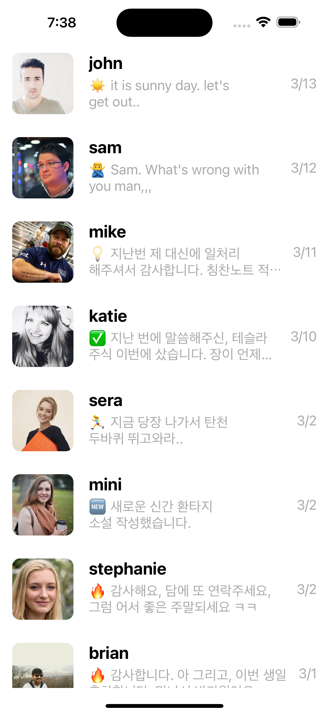
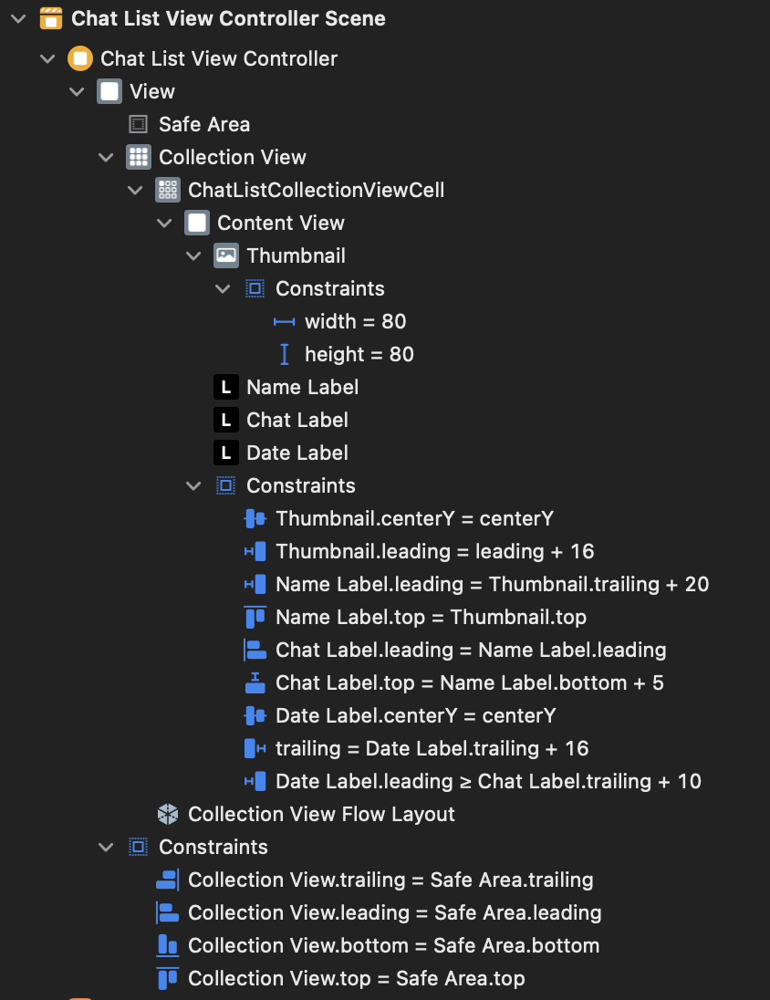

# ChatList 프로젝트
# 사용 기술
- StoryBoard 
    - CollectionView 사용
    - Auto Layout 설정

- ViewController
    - CollectionView : DataSource, Delegate 사용(self로 extension 사용)
    - extension DataSource : 데이터 셋팅(casting 사용)
    - extension DelegateFlowLayout : CGSize 설정
    - [Sorted(by:)](https://developer.apple.com/documentation/swift/array/sorted(by:)) : sorted를 통한 날짜 오름차순 정렬

- CollectionViewCell
    - configure : 데이터 셋팅
    - DateFormatter : formatter 이용해서 날짜 형식 변환
    - awakefromnib : StoryBoard 생성시 Layout 등 꾸며주는 함수



0. ChatList 구조체 및 assets 파일 가져오기
    - name, chat, date
    - assets에 있는 사람 사진들 들고오기
1. UI 만들기
    - Collection View
        - ChatListCollectionViewCell
            - ContentView
                - ImgView - 사람 사진
                - Label - 이름
                - Label - 채팅
                - Label - 날짜
2. CollectionView 연결
    - Data -> 어떤 데이터?
    - Presentation -> 셀을 어떻게 표현?
    - Layout -> 셀을 어떻게 배치?
3. CollectionView 데이터 업로드
    - UIComponent 연결
    - UIComponent 데이터 업로드 코드 작성
4. 짜잘한 UI 코드 수정
    - 날짜 정렬을 통한 최근 날짜 우선
    - 날짜 형식 바꾸기
    - 이미지의 모서리 둥글게

<br><br><br>

# UI 만들기(StoryBoard)
1. Collection View 만들기
2. Collection View안에 Cell 만들기(복사될)
3. Label 및 여러가지 필요한 UI 넣기
4. 각 UI에 맞는 AutoLayout 설정
    - ctrl으로 상위의 UI에 연결해서 위 맞추기 등

## 최종 결과 StoryBoard


<br><br><br>

# ChatListViewController 작성 
## 1. collectionView 가져오기
```Swift
@IBOutlet weak var collectionView: UICollectionView!
```

## 2. 데이터 구조체 가져오기
```Swift
var chatList: [Chat] = Chat.list
```

## 3. collectionView에 필요한 객체 가져오기
```Swift
override func viewDidLoad() {
    super.viewDidLoad()
    // Data, Presentation, Layout
    
    // Data, Presentation
    collectionView.dataSource = self
    // Layout
    collectionView.delegate = self
    
    // 날짜 정렬을 위한 코드
    chatList = chatList.sorted { chat1, chat2 in
        return chat1.date > chat2.date
    }
}
```

## 4. DataSource extension 작성
데이터 처리해서 넣어주는 부분
```Swift
extension ChatListViewController: UICollectionViewDataSource{
    func collectionView(_ collectionView: UICollectionView, numberOfItemsInSection section: Int) -> Int {
        return chatList.count
    }
    
    func collectionView(_ collectionView: UICollectionView, cellForItemAt indexPath: IndexPath) -> UICollectionViewCell {
        //gaurd 안넣으면 error
        guard let cell = collectionView.dequeueReusableCell(withReuseIdentifier: "ChatListCollectionViewCell", for: indexPath) as? ChatListCollectionViewCell else {
            return UICollectionViewCell()
        }
        let chat = chatList[indexPath.item]
        cell.configure(chat)
        
        return cell
    }
}
```

## 5. DelegateFlowLayout extension 작성
CollectionView Cell 크기 수정
```Swift
extension ChatListViewController: UICollectionViewDelegateFlowLayout {
    func collectionView(_ collectionView: UICollectionView, layout collectionViewLayout: UICollectionViewLayout, sizeForItemAt indexPath: IndexPath) -> CGSize {
        return CGSize(width: collectionView.bounds.width, height: 100)
    }
}
```

<br><br><br>

# ChatListCollectionViewCell 작성
## 1. UIComponent 연결
1. Storyboard에서 CollectionViewCell에 가서 우측의 class및 Identifier 수정
2. 클릭하여 Assistant의 코드 부분을 ChatListCollectionViewCell로 변경
3. ctrl로 Label 및 ImgView 끌고오기
```Swift
@IBOutlet weak var thumbnail: UIImageView!
@IBOutlet weak var nameLabel: UILabel!
@IBOutlet weak var chatLabel: UILabel!
@IBOutlet weak var dateLabel: UILabel!
```

## 2. UIComponent 데이터 업로드 코드 작성
함수를 만들어 데이터 업로드 코드 작성<br>
formattedDateString을 통해 날짜 형식 변환
```Swift
func configure(_ chat: Chat){
    thumbnail.image = UIImage(named: chat.name)
    nameLabel.text = chat.name
    chatLabel.text = chat.chat
    dateLabel.text = formattedDateString(dateString: chat.date)
}
```

<br><br><br>

# UI 짜잘한 추가 작업
## 1. 이미지 모서리 둥글게 하는 함수
[awakefromnib](https://developer.apple.com/documentation/objectivec/nsobject/1402907-awakefromnib) 함수를 이용해 Interface 생성시 호출하여 radius 주기
```Swift
// 파일 : ChatListCollectionViewCell.swift
override func awakeFromNib() {
    super.awakeFromNib()
    thumbnail.layer.cornerRadius = 10
}
```

## 2. 날짜 형식 변환을 위한 함수 추가
DateFormatter를 이용해 2024-01-15를 1/15로 변환
```Swift
// 파일 : ChatListCollectionViewCell.swift
func formattedDateString(dateString: String) -> String{
    // 2022-04-01 -> 4/1
    let formatter = DateFormatter()
    formatter.dateFormat = "yyyy-MM-dd"
    
    // 문자열 -> date
    if let date = formatter.date(from: dateString){
        formatter.dateFormat = "M/d"
        return formatter.string(from: date)
    }else {
        return ""
    }
}
```

## 3. 날짜 형식 변환을 위한 함수 추가
[sorted(by: )](https://developer.apple.com/documentation/swift/array/sorted(by:)) 함수를 통해서 정렬
```Swift
// 파일 : ChatListViewController.swift
chatList = chatList.sorted (by:{ chat1, chat2 in
    return chat1.date > chat2.date
})
```

<br><br><br>

# 💡 알아간 부분
1. numberOfLines을 바꿔서 한줄에 출력되는 문자의 길이 2줄로 변경
2. formatter를 통한 받은 날짜 형식 변경
3. sorted와 sort
4. awakefromnib을 통한 UI 수정

# [전체 코드](https://github.com/alstjr7437/IosFirstStudy/tree/main/ChatList/ChatList)
[StoryBoard](https://github.com/alstjr7437/IosFirstStudy/blob/main/ChatList/ChatList/Base.lproj/Main.storyboard)<br>
[ViewController](https://github.com/alstjr7437/IosFirstStudy/blob/main/ChatList/ChatList/ChatListViewController.swift)<br>
[CollectionViewCell](https://github.com/alstjr7437/IosFirstStudy/blob/main/ChatList/ChatList/ChatListCollectionViewCell.swift)