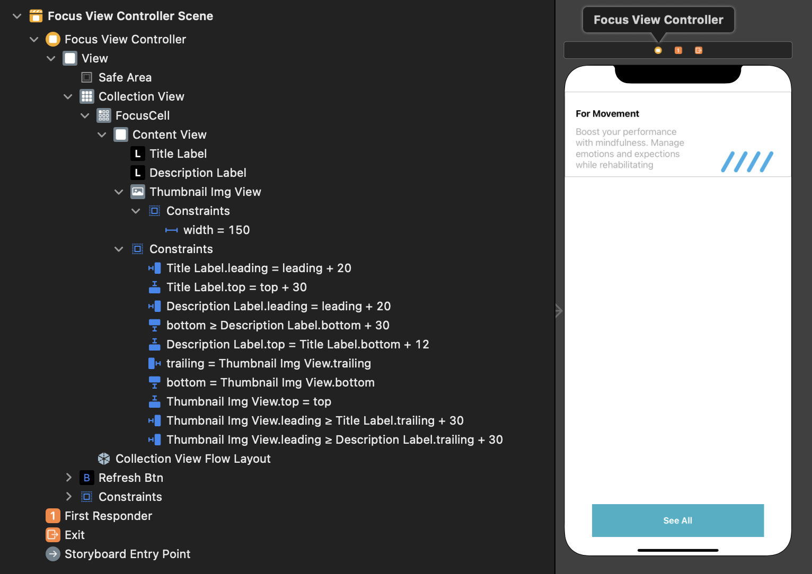
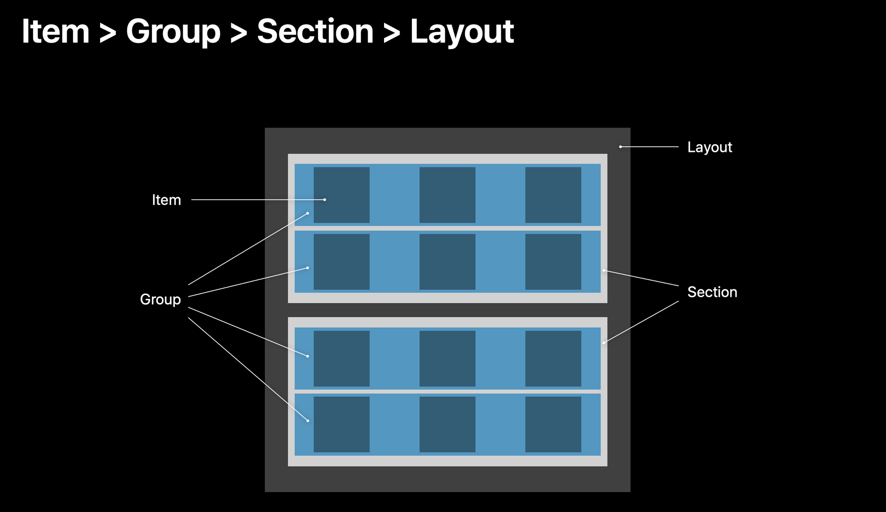

# NRCOnboarding 프로젝트
# 사용 기술
- StoryBoard 
    - CollectionView 사용
    - Button 사용

- ViewController
    - CollectionView : DiffableDataSource 사용
    - DiffableDataSource 사용 - Presentation 부분
    - snapshot 사용 - Data 부분
    - CompositionalLayout - Layout 부분
    - 삼항 연산자를 통한 Btn 클릭시 텍스트 변경

- CollectionViewCell(Result, Home)
    - configure : Cell 데이터 셋팅
    - awakeFromNib : 각 셀 생김새 설정

 

<br><br><br>

# 작업 순서

1. UI 만들기
    - 전체 배경 화면(Auto Layout - View와)
    - Collection View
        - Focus Cell
            - ContentView
                - Title Label - 제목
                - Description Label - 내용
                - ThumnailImgView - 썸네일 이미지
    - Refresh Button - 아이템 변경 버튼

2. CollectionView 연결
    - datasource : UICollectionViewDiffableDataSource 작성
    - snapshot : NSDiffableDataSourceSnapshot 작성
    - Layout : UICollectionViewCompositionalLayout 작성
3. CollectionView 데이터 업로드
    - UIComponent 연결
    - UIComponent 데이터 업로드 코드 작성

<br><br><br>

# 최종 결과 StoryBoard



<br><br><br>

# collectionView 만들기
## 1. DiffableDataSource만들기
DiffableDataSource의 Presentation 부분 만들기

원래의 DataSource에서 Section Item을 사용함<br>
그리고 코드 안에 부분은 guard로 Cell을 들고와서 사용하는게 똑같음
```swift
var items: [Focus] = Focus.list

enum Section {
    case main
}
typealias Item = Focus

var datasource: UICollectionViewDiffableDataSource<Section, Item>!
    

override func viewDidLoad() {
    super.viewDidLoad()
    datasource = UICollectionViewDiffableDataSource<Section, Item>(collectionView: collectionView, cellProvider: { collectionView, indexPath, item in
        guard let cell = collectionView.dequeueReusableCell(withReuseIdentifier: "FocusCell", for: indexPath) as? FocusCell else {
            return nil
        }
        let data = self.items[indexPath.item]
        cell.configure(data)

        return cell
    })
}
```
<br>

위 코드 중 data를 설정하는 방법에는 두개가 있는데<br>
아래 코드의
- 1번 부분은 self.items로 데이터를 직접 가져와 데이터 소스가 명확하고 코드 가독성이 높아짐
- 2번 부분은 클로저의 매개변수인 item을 사용해서 소스가 명시적으로 나오진 않음
하지만 코드가 간결해짐
```swift

// 1
var items: [Focus] = Focus.list

datasource = UICollectionViewDiffableDataSource<Section, Item>(collectionView: collectionView, cellProvider: { collectionView, indexPath, item in // 2번의 item 사용

// 1 
let data = self.items[indexPath.item]
cell.configure(data)

// 2
cell.configure(item)
})
```
<br><br>

## 2. Snapshot 만들기
DiffableDataSource의 Data 부분 만들기

따로 필요한 UI부분이 .main의 하나의 collectionViewCell을 사용해서 .main을 사용<br>
DiffableDataSource라 Section, item 사용
1. append Section - main 섹션 추가
2. append Item - main 섹션에 items 추가
3. apply - 구성한 스냅샷 데이터 소스에 적용
```swift
var snapshot = NSDiffableDataSourceSnapshot<Section, Item>()
snapshot.appendSections([.main])
snapshot.appendItems(items, toSection: .main)
datasource.apply(snapshot)
```
<br><br>

## 3. Compositional Layout 만들기
DiffableDataSource의 Layout 부분 만들기 

조금 복잡하지만 이해를 하면 불러와서 넣어주면서 작성 가능<br>


위 사진에서 layout 부터 거꾸로 내려간다고 생각하면 편함

> ## ⭐️⭐️⭐️⭐️⭐️ layout 코드 작성 순서
> 1. layout 만들기 -> section이 필요하다고 에러
> 2. section 만들기 -> group이 필요하다고 에러
> 3. group 만들기 -> groupSize와 item이 필요하다고 에러
>    - groupSize 만들기(widthDimension, heightDimension)
> 4. Item 만들기 -> itemSize가 필요하다고 에러
>    - itemSize 만들기(widthDimension, heightDimension)

위와 같이 layout 작성 후 UI의 짜잘한 부분인<br>
여백 설정 및 spacing 설정해주기(코드의 주석 표시 부분)
<br>

```swift
private func layout() -> UICollectionViewCompositionalLayout{
    
    //estimated 50이긴한데 컨텐츠에 따라 변경이 될 수 있다.
    let itemSize = NSCollectionLayoutSize(widthDimension: .fractionalWidth(1), heightDimension: .estimated(50))
    let item = NSCollectionLayoutItem(layoutSize: itemSize)
    
    let groupSize = NSCollectionLayoutSize(widthDimension: .fractionalWidth(1), heightDimension: .estimated(50))
    let group = NSCollectionLayoutGroup.vertical(layoutSize: groupSize, subitems: [item])
    
    let section = NSCollectionLayoutSection(group: group)
    // 짜잘한 UI
    section.contentInsets = NSDirectionalEdgeInsets(top: 10, leading: 20, bottom: 10, trailing: 20)     // 각 끝 부분에 여백 만들기
    section.interGroupSpacing = 10      // group간 spacing으로 거리 주기
    
    let layout = UICollectionViewCompositionalLayout(section: section)

    return layout
}
```
<br><br><br>

# Btn을 들고와서 데이터 변경 코드
updateBtnTitle 함수는 viewDidLoad도 사용하고 버튼 클릭시도 사용해서 함수화

버튼 클릭시 동작 
1. curated의 Bool을 toggle()을 통해 True로 변경
2. 삼항 연산자를 통해 Focus 구조체의 recommand와 전체 중 결정
3. snapshot(data)를 수정하여서 데이터 변경
4. apply를 통해 적용
5. Btn 함수를 호출해 버튼의 title도 변경
```swift
func updateBtnTitle(){
    let title = curated ? "See All" : "See Recommendation"
    refreshBtn.setTitle(title, for: .normal)
}

@IBAction func refreshBtnTapped(_ sender: Any) {
    curated.toggle()
    self.items = curated ? Focus.recommendations : Focus.list
    
    var snapshot = NSDiffableDataSourceSnapshot<Section, Item>()
    snapshot.appendSections([.main])
    snapshot.appendItems(items, toSection: .main)
    
    datasource.apply(snapshot)
    
    updateBtnTitle()
}
```

<br><br><br>

# 💡 알아간 부분

### 1. Code로 UI 수정
storyBoard에서 까먹은 UI 부분을 아래와 같이 코드에서 작성하여서 수정을 함<br>
이러다가 선언까지 그냥 코드로 하면서 코드 형식의 UI를 짤 것 같음.
```swift
contentView.backgroundColor = UIColor.systemIndigo
contentView.layer.cornerRadius = 10

@IBOutlet weak var refreshBtn: UIButton!
refreshBtn.layer.cornerRadius = 10
```

<br><br>

### 2. DiffableDataSource 직접 전부 만들어보기
아직 안보고 처음부터 만들라고 하면 만들지는 못하겠지만 UI 부분에서 어떻게 작성을 해갈지는 완벽히 이해를 하게 되는 계기였던 것 같음

아직 Section과 Item 부분의 enum과 typealias를 사용하는 부분이 정확히 이해 안가지만 계속 작성하면서 이해할 예정

# 💻 [전체 코드](https://github.com/alstjr7437/iOSFirstStudy/tree/main/HeadSpaceFocus)
[StoryBoard](https://github.com/alstjr7437/iOSFirstStudy/blob/main/HeadSpaceFocus/HeadSpaceFocus/Base.lproj/Main.storyboard)<br>
[OnboardingViewController](https://github.com/alstjr7437/iOSFirstStudy/blob/main/HeadSpaceFocus/HeadSpaceFocus/FocusViewController.swift)<br>
[OnboardingCell](https://github.com/alstjr7437/iOSFirstStudy/blob/main/HeadSpaceFocus/HeadSpaceFocus/FocusCell.swift)
