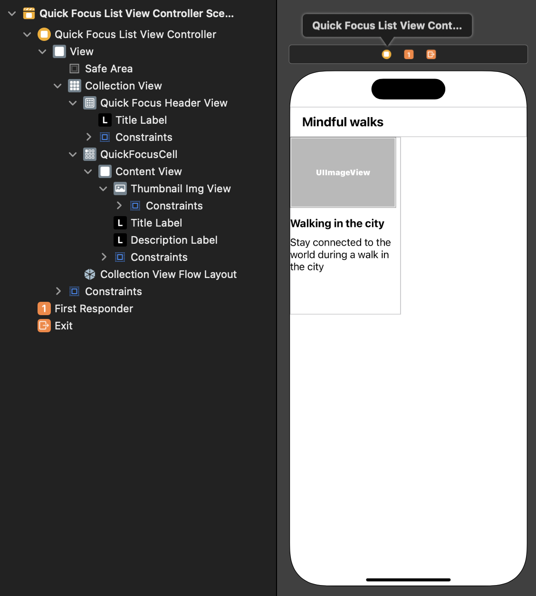
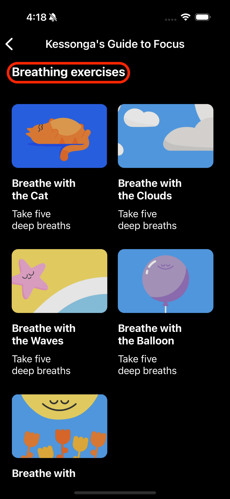
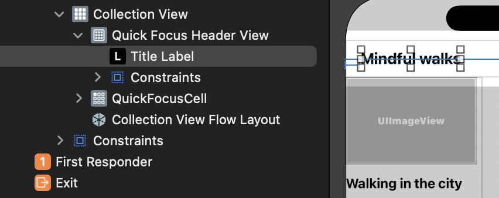
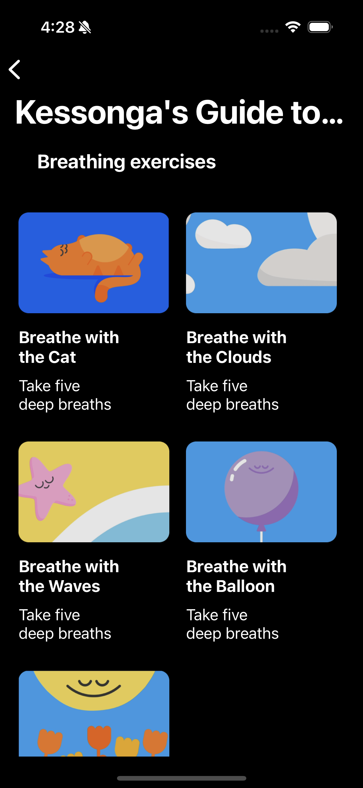
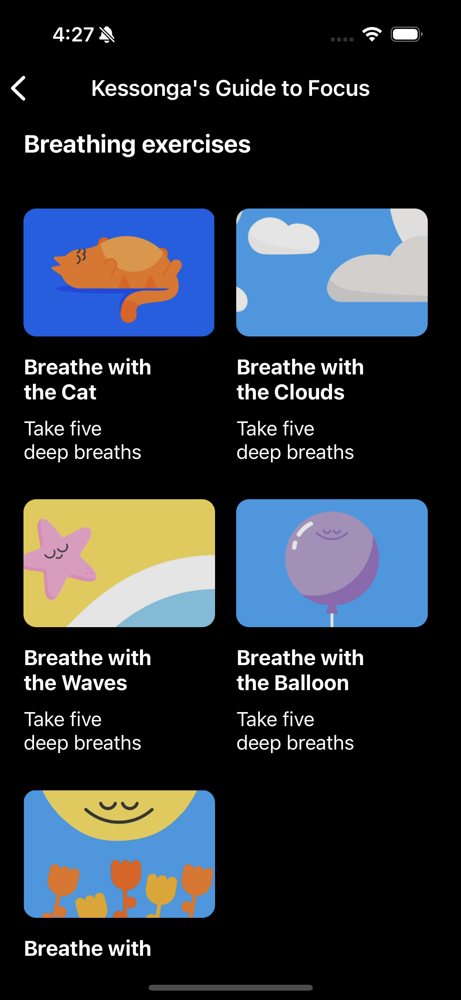
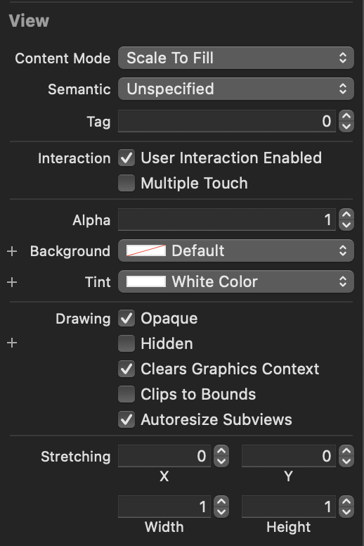

# [명상 컨텐츠 프로젝트](https://github.com/alstjr7437/TIL/blob/main/Swift/Uikit/Study/HeadSpaceFocus/HeadSpaceFocus.md)(추가)
# + 사용 기술
- StoryBoard 
    - CollectionView 사용
        - Reusable view
        - Cell
        - Section 두개 만들기
    - Navigation Controller

- ViewController
    - CollectionView : DiffableDataSource 사용
    - DiffableDataSource 사용 - Presentation 부분
    - snapshot 사용 - Data 부분
    - CompositionalLayout - Layout 부분
    - supplementaryViewProvider - HeaderView 부분

- QuickFocusHeaderView
    - configure : 데이터 셋팅

 

<br><br><br>

# 작업 순서

1. UI 만들기
    - 전체 배경 화면(Auto Layout - View와)
    - Navigation 
    - Collection View
        - Quick Focus Header View 
            - Text - Header 이름
        - Quick Focus Cell
            - ContentView
                - ThumnailImgView - 썸네일 이미지
                - Title Label - 제목
                - Description Label - 내용

2. CollectionView 연결
    - datasource : UICollectionViewDiffableDataSource 작성
    - snapshot : NSDiffableDataSourceSnapshot 작성
    - Layout : UICollectionViewCompositionalLayout 작성
    - supplementaryViewProvider : Header 연결 작성
3. CollectionView 데이터 업로드
    - UIComponent 연결
    - UIComponent 데이터 업로드 코드 작성

<br><br><br>

# 최종 결과 StoryBoard



<br><br><br>

# collectionView 만들기

## 전체적인 Cell 작성
기존의 배우던 방식인 DiffableDataSource를 사용해서 작성

## 이번에는 두개의 Section이 존재
```swift
// Section 부분
enum Section: CaseIterable {
    case breathe
    case walking
    // 두줄의 코드는 같음 CaseIterable을 준수해서 allcase로 사용 가능
//        Section.allCases
//        let allItems:[Section] = [.breathe, .walking]
    var title: String{
        switch self{
        case .breathe: return "Breathing exercises"
        case .walking: return "Mindful walks"
        }
    }
}

// Presentation 부분
datasource.supplementaryViewProvider = { (collectionView, kind, indexPath) in
    guard let header = collectionView.dequeueReusableSupplementaryView(ofKind: UICollectionView.elementKindSectionHeader, withReuseIdentifier: "QuickFocusHeaderView", for: indexPath) as? QuickFocusHeaderView else {
        return UICollectionReusableView()
    }
    let allSections = Section.allCases
    let section = allSections[indexPath.section]
    
    header.configure(section.title)
    
    return header
}

// snapshot 부분
// Data
var snapshot = NSDiffableDataSourceSnapshot<Section, Item>()
snapshot.appendSections([.breathe, .walking])
//        snapshot.appendSections(Section.allCases)
snapshot.appendItems(breathingList, toSection: .breathe)
snapshot.appendItems(walkingList, toSection: .walking)
```

### 짜잘한 UI 배우기

LayoutSize 조정
```swift
// 각 글 길이에 맞게 옆에도 맞게 맞출때 estimated
let groupSize = NSCollectionLayoutSize(widthDimension: .fractionalWidth(1), heightDimension: .estimated(50))
```

group의 아이템 개수 조정
```swift
// 칼럼 두개 꼭 채우고 싶을떄
let group = NSCollectionLayoutGroup.horizontal(layoutSize: groupSize, repeatingSubitem: item, count: 2)
// let group = NSCollectionLayoutGroup.horizontal(layoutSize: groupSize, subitems: [item])
```

<br><br>

# Reusable View 만들기
각 섹션의 Header 느낌의 View 만들기



위 사진의 빨간색 부분

## 1. 스토리보드 추가하기 

<br><br>

## 2. Custom Class 생성하기
cell과 똑같이 Custom Class 생성해서 연동해주기

```swift
import UIKit

class QuickFocusHeaderView: UICollectionReusableView {
    
    @IBOutlet weak var titleLabel: UILabel!
    
    func configure(_ title: String){
        titleLabel.text = title
    }
    
}
```
<br><br>

## 3. datasource에 추가하기
cell과 마찬가지로 header 추가해주기
```swift
datasource.supplementaryViewProvider = { (collectionView, kind, indexPath) in
    guard let header = collectionView.dequeueReusableSupplementaryView(ofKind: UICollectionView.elementKindSectionHeader, withReuseIdentifier: "QuickFocusHeaderView", for: indexPath) as? QuickFocusHeaderView else {
        return UICollectionReusableView()
    }
    let allSections = Section.allCases
    let section = allSections[indexPath.section]
    
    header.configure(section.title)
    
    return header
}
```
<br><br>

## 4. Layout도 추가해주기
Layout 부분에 추가해주기
```swift
let headerSize = NSCollectionLayoutSize(widthDimension: .fractionalWidth(1), heightDimension: .absolute(50))
let header = NSCollectionLayoutBoundarySupplementaryItem(layoutSize: headerSize, elementKind: UICollectionView.elementKindSectionHeader, alignment: .top)
section.boundarySupplementaryItems = [header]
```

<br><br><br>

# Navigation 추가 및 이동
Main에 Editor -> Embed In으로 Navigation 추가<br>
Title 등 Navigation 꾸며주기

Navigation을 통한 여러가지 이동이 생겼을떄<br>
present 부분으로 이동하던걸 pushViewController로 이동했음.

```swift
// present(vc, animated: true)
navigationController?.pushViewController(vc, animated: true)
```

<br><br>

## Navigation Title

 

위 사진 처럼<br>
원래는 UI에 Large로 보이지만 세부로 들어가면 Navigation에만 보이면 되기 때문에<br>
아래 코드 추가!

```swift
// 바로 들어가서 Large title이 아닌 바로 네비게이션에 뜨도록 
// 오른쪽 사진이 아래 코드 넣었을떄
self.navigationItem.largeTitleDisplayMode = .never
```

<br><br>

## Navigation 뒤로가기 색깔

 

위 사진들과 같이 뒤로가기 버튼 수정하기<br>
Navigation -> Navigation Bar -> View -> Tint




<br><br><br>

# 💡 알아간 부분

### 1. Navigation 부분
오래만에 Navigation을 만들고 navigation을 통한 이동을 연습함.<br>

### 2. Section의 여러가지 아이템 부분

### 3. 이동 동작 부분
```swift
extension FocusViewController: UICollectionViewDelegate {
    func collectionView(_ collectionView: UICollectionView, didSelectItemAt indexPath: IndexPath) {
        let item = items[indexPath.item]
        
        print(">>>>\(item.title)")
        
        let storyboard = UIStoryboard(name: "QuickFocus", bundle: nil)
        let vc = storyboard.instantiateViewController(withIdentifier: "QuickFocusListViewController") as! QuickFocusListViewController
//        present(vc, animated: true)
        vc.title = item.title
        navigationController?.pushViewController(vc, animated: true)
        
    }
}

```

<br><br>


# 💻 [전체 코드](https://github.com/alstjr7437/iOSFirstStudy/tree/main/HeadSpaceFocus)
[Main StoryBoard](https://github.com/alstjr7437/iOSFirstStudy/blob/main/HeadSpaceFocus/HeadSpaceFocus/Base.lproj/Main.storyboard)<br>
[QuickFocus StoryBoard](https://github.com/alstjr7437/iOSFirstStudy/blob/main/HeadSpaceFocus/HeadSpaceFocus/QuickFocus.storyboard)<br>

[FocusController](https://github.com/alstjr7437/iOSFirstStudy/blob/main/HeadSpaceFocus/HeadSpaceFocus/FocusViewController.swift)<br>
[QuickFocusListViewController](https://github.com/alstjr7437/iOSFirstStudy/blob/main/HeadSpaceFocus/HeadSpaceFocus/QuickFocusListViewController.swift)<br>

[FocusCell](https://github.com/alstjr7437/iOSFirstStudy/blob/main/HeadSpaceFocus/HeadSpaceFocus/FocusCell.swift) <br>
[QuickFocusCell](https://github.com/alstjr7437/iOSFirstStudy/blob/main/HeadSpaceFocus/HeadSpaceFocus/QuickFocusCell.swift)<br>

[QuickFocusHeaderView](https://github.com/alstjr7437/iOSFirstStudy/blob/main/HeadSpaceFocus/HeadSpaceFocus/QuickFocusHeaderView.swift)
