# InstaSearchView 프로젝트
# 사용 기술
- StoryBoard 
    - CollectionView 사용
    - Auto Layout 설정
    - [TabBar](https://developer.apple.com/documentation/uikit/uitabbar) 사용
    - Navigation 사용
    - SearchController 사용

- ViewController(SearchView, Home)
    - CollectionView : DataSource, Delegate 사용(self로 extension 사용)
    - flowlayout : size automatic 풀어주기
    - extension DataSource : 데이터 셋팅(casting 사용)
    - extension DelegateFlowLayout
        - sizeForItemAt를 이용해 CGSize 설정(한줄 갯수 설정 등)
        - 셀 사이 간격 조절
            - minimumInteritemSpacingForSectionAt : 셀 사이 최소 간격 반환
            - minimumLineSpacingForSectionAt : 행 사이 최소 간격 반환
    - [SearchController](https://hyesunzzang.tistory.com/51) 사용
    - UISearchResultsUpdating : 검색바 동작 이벤트 처리

- CollectionViewCell(Result, Home)
    - prepareForReuse : 시작시 셋팅
    - configure : Cell 데이터 셋팅


1. UI 만들기
    - Search Collection View
        - ResultCell
            - ContentView
                - thumbnailImgView - 동물 사진
    - Home Collection View
        - HomeCell
            - ContentView
                - pawprint - 발바닥 사진
                - NameLabel - 이름
                - thumbnailImgView - 동물 사진
    - TabBar Controller
    - Navigation Controller

2. CollectionView 연결
    - DataSource
    - Delegate
        - FlowLayout
3. CollectionView 데이터 업로드
    - UIComponent 연결
    - UIComponent 데이터 업로드 코드 작성
3. TabBar 만들기
    - TabBar 생성
    - 각 Scene 연결
4. 짜잘한 UI 코드 수정
    - 네비게이션바 만들기
    - Search부분 만들기
    - superView
    - aspect fill

<br><br><br>

# UI 만들기(StoryBoard)
1. Collection View 만들기
2. Collection View안에 Cell 만들기(복사될)
3. Label 및 여러가지 필요한 UI 넣기
4. 각 UI에 맞는 AutoLayout 설정
    - ctrl으로 상위의 UI에 연결해서 위 맞추기 등
5. TabBar 만들기
    1. ViewController 클릭
    2. Editor -> Embed In -> TabBar Controller 클릭
    3. Scene 더 만들기
    4. TabBar에서 ctrl 누르고 마우스로 땡기기
    5. Relationship Seque -> view controllers 눌러서 연동하기
    6. 각 Scene에서 TabBar 수정해서 보여질 이미지나 텍스트 수정하기
    
6. Navigation 만들기
    1. ViewController 클릭
    2. Editor -> Embed In -> Navigation Controller 클릭
    3. 코드나 StoryBoard로 보여질 텍스트 수정하기

## 최종 결과 StoryBoard
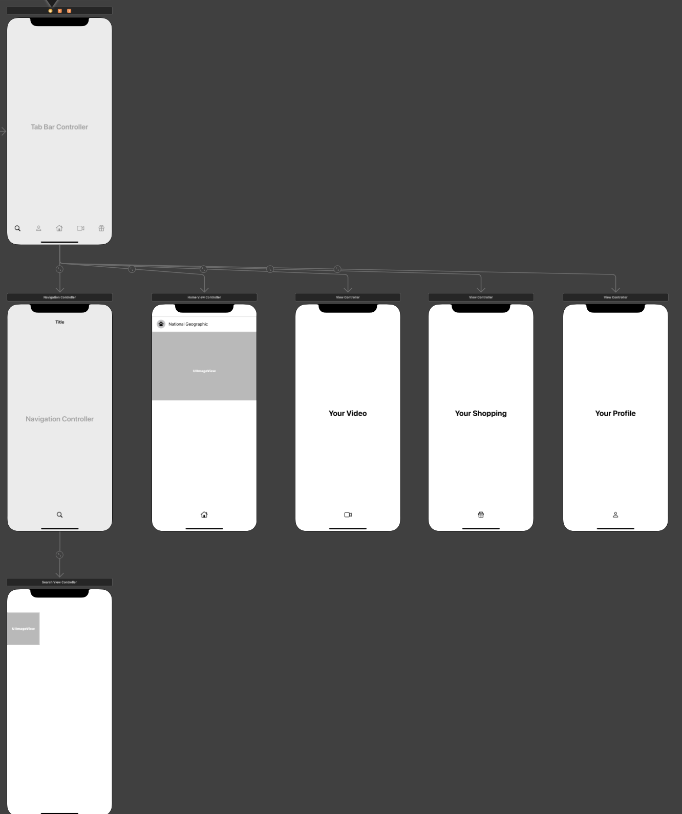
<br><br><br>

# TabBar 만들기
## 1. TabBar Controller 만들기
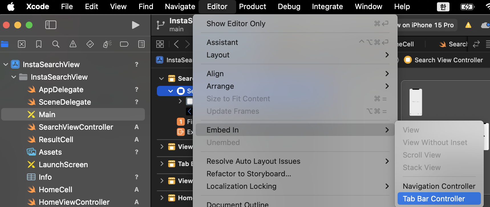
위 사진과 같이 클릭시 TabBar Controller가 StoryBoard에 생김

## 2. Scene 만들기
'+' 를 눌러서 Scene 만들기(TabBar로 옮겨갈 View)

## 3. 각 Scene TabBar에 연동하기
1. ctrl을 누르고 Scene에 옮기기 <br>
2. Relationship Seque -> view controllers를 눌러서 연동하기 <br>

연동시 아래 사진과 같이 연동되어 있는 부분을 확인할 수 있음
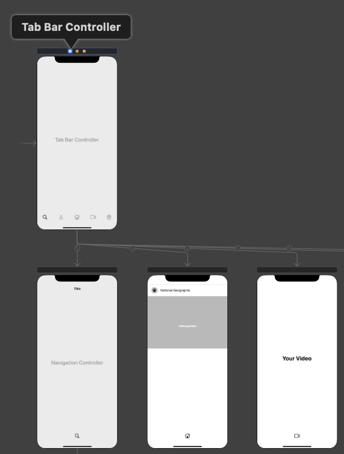

## 4. 연동된 TabBar 이미지나 텍스트 수정하기
각 View Controller에 가서 TabBar Item 수정해서 TabBar에 보여질 이미지나 텍스트 만들기<br>
이번 프로젝트는 따로 Text없이 아이콘으로만 해서 image에 house만 들어감
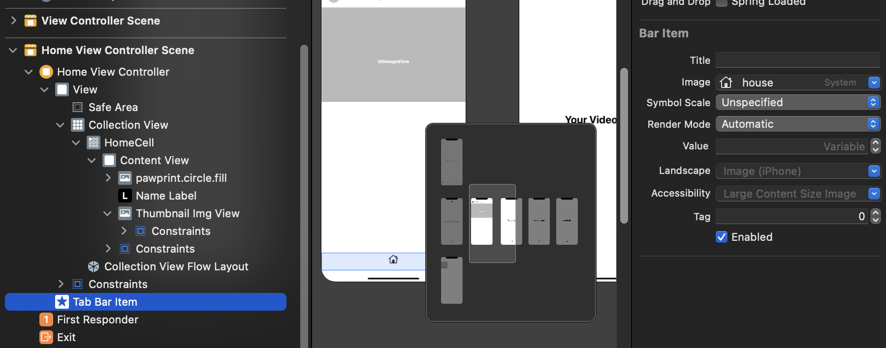

<br><br><br>

# 네비게이션 검색창 만들기
## 1. 네비게이션 만들기
저번 프로젝트인 [AppleFramework](https://github.com/alstjr7437/TIL/blob/main/Swift/Uikit/Study/AppleFramework/AppleFramework.md)에서 처럼 StoryBoard에 Navigation 만들고 title 설정
```swift
self.navigationItem.title = "Search"
```

## 2. SearchController 만들기(코드 이용)
검색창을 위한 Search Controller 만들기
```swift
// 파일 : SearchViewController에 viewDidLoad 부분

let seachController = UISearchController(searchResultsController: nil)
// 검색컨트롤러는 검색하는 동안 네비게이션바에 가려지지않도록한다
seachController.hidesNavigationBarDuringPresentation = false
// 검색 전에 무슨 내용으로 채워져 있는지
seachController.searchBar.placeholder = "Saech"
// extension으로 결과 업데이트시 동작 함수
seachController.searchResultsUpdater = self
// 네비게이션 아이템에 searchController 추가하기
self.navigationItem.searchController = seachController
```

## 3. 동작을 위한 extension 작성하기
검색창에 text 변경시 print해주는 코드
```swift
// 파일 : SearchViewController에 extension

extension SearchViewController: UISearchResultsUpdating{
    func updateSearchResults(for searchController: UISearchController) {
        let search = searchController.searchBar.text
        print("search: \(search)")
    }
}
```

<br><br><br>
# White Color, Label Color
다크모드일때는 white가 나와야해서 상관 없지만<br>
다크모드가 아닐때는 white가 아닌 black이 나와야함.<br>
> **white color** -> white로 고정되게 설정<br>
**Label color** -> 각 다크모드 등 상황에 맞게 색 변경 <br>

white color -> 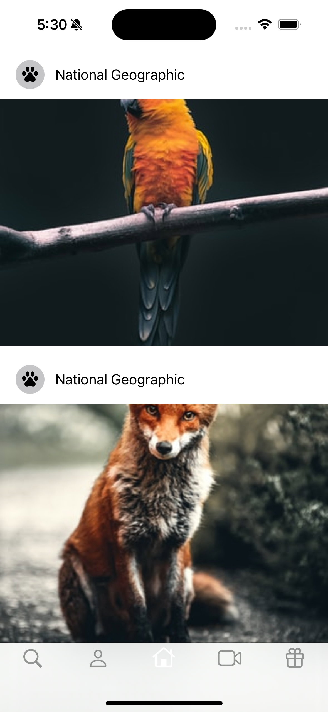
Label color -> 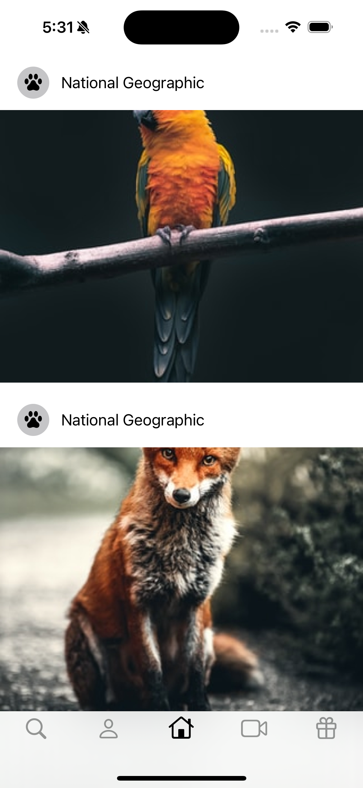

<br><br><br>
# 이미지 가로 세로 비율 설정하기
1. 아래 사진과 같이 img를 본인에게 끌고와 Aspect Radio 클릭<br>
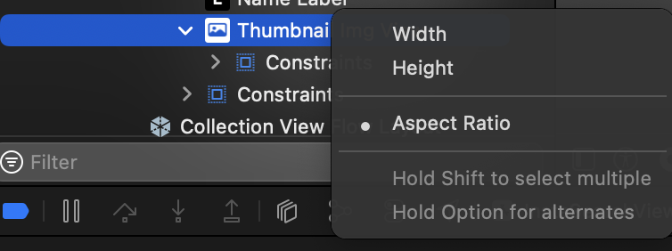

2. 비율 설정해주기
아래 사진과 같이 가로(4) : 세로(3) 비율로 설정해주기
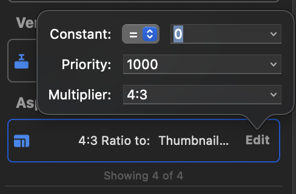
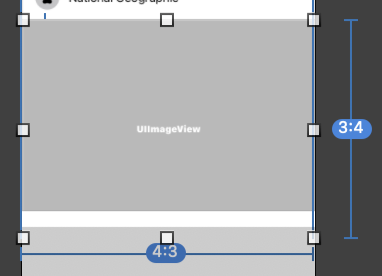
<br><br>

5:3 -> 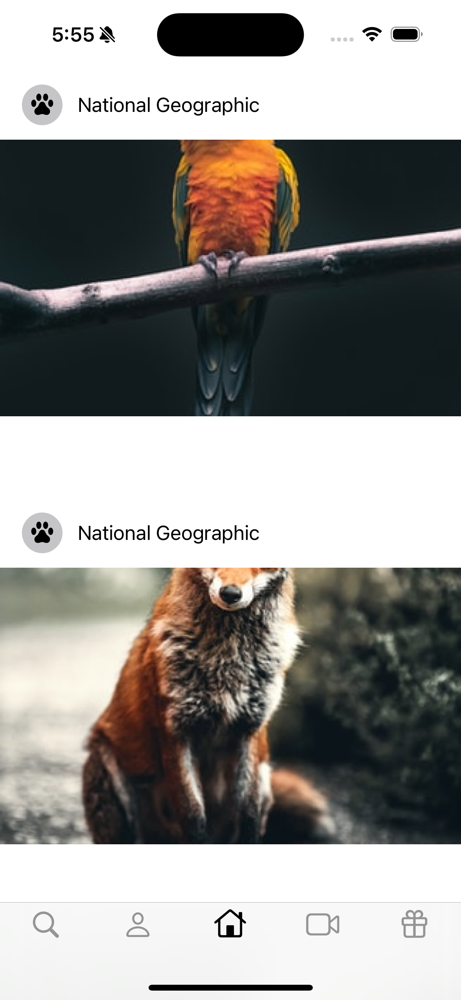
4:3 -> 

<br><br><br>

# Aspect fit, Aspect fill, Scale To Fill
> ### scaleAspectFit(Aspect Fit) 
> **비율을 유지하면서** 뷰의 **사이즈에 맞게 이미지를 늘리는** 옵션 **남는 부분은 투명 처리**
> ### scaleAspectFill(Aspect Fill)
> **비율을 유지하면서** 뷰의 **이미지를 꽉 채우는** 옵션 **어떤 부분은 잘려 보일 수 있음**(아래 사진과 같이 앵무새 머리가 짤릴 수도)
> ### scaleToFill(Scale To Fill) 
> **전체 이미지가 다 나올 수 있도록** 필요하다면 **비율을 깨트리면서** 뷰의 사이즈에 맞게 **이미지를 꽉 채우는** 옵션(아래 사진과 이미지 비율이 이상해짐)

Aspect fit -> 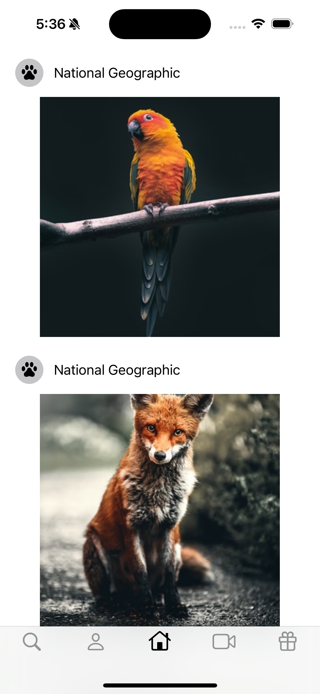
Aspect Fill -> 
Scale To Fill -> 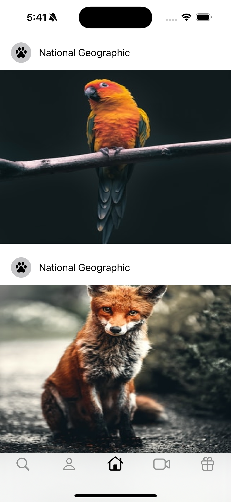

<br><br><br>
# 💡 알아간 부분
1. TabBar를 통한 ViewController 이동 
2. Aspect Ratio를 통한 이미지 비율 설정
3. 이미지 [Content Mode](https://sujinnaljin.medium.com/ios-%EC%82%AC%EC%A7%84%EC%9C%BC%EB%A1%9C-%EB%B3%B4%EB%8A%94-aspectfit-aspectfit-scaletofill-f41470d0191f) 설정(Aspect Fill, Fit, Scale To Fill 등)
4. Label Color
5. Search 부분 구현하기

# 전체 코드
[StoryBoard](https://github.com/alstjr7437/IosFirstStudy/blob/main/InstaSearchView/InstaSearchView/Base.lproj/Main.storyboard)<br>
[SearchViewController](https://github.com/alstjr7437/IosFirstStudy/blob/main/InstaSearchView/InstaSearchView/SearchViewController.swift)<br>
[HomeViewController](https://github.com/alstjr7437/IosFirstStudy/blob/main/InstaSearchView/InstaSearchView/HomeViewController.swift)<br>
[ResultCell](https://github.com/alstjr7437/IosFirstStudy/blob/main/InstaSearchView/InstaSearchView/ResultCell.swift)<br>
[HomeCell](https://github.com/alstjr7437/IosFirstStudy/blob/main/InstaSearchView/InstaSearchView/HomeCell.swift)
