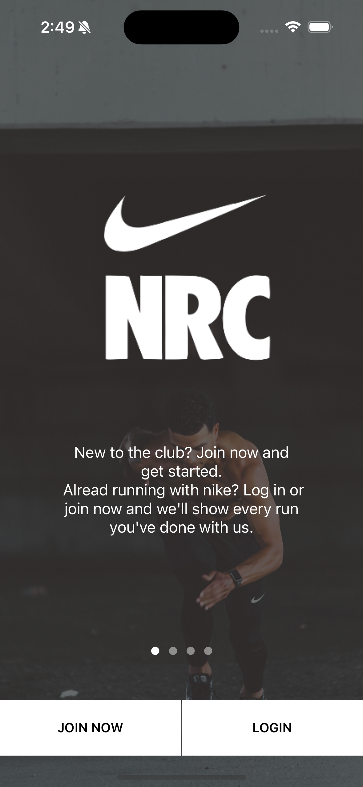
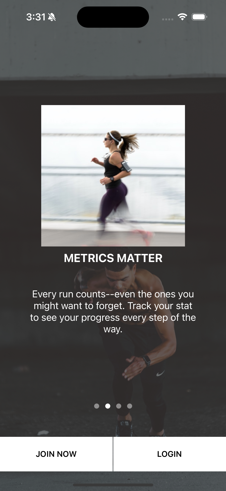
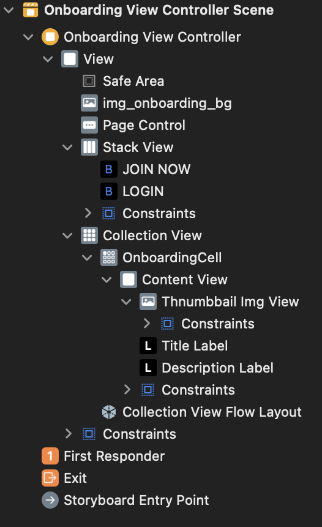
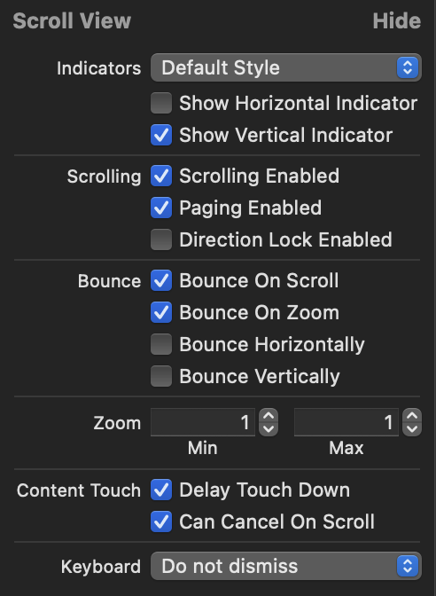
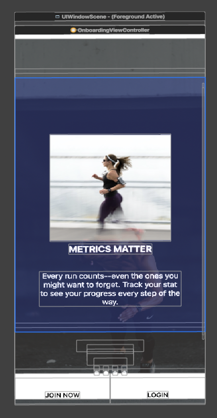

# NRCOnboarding 프로젝트
# 사용 기술
- StoryBoard 
    - CollectionView 사용
    - Page Comtrol 사용
    - Collection View - ScrollView 사용

- ViewController
    - CollectionView : DataSource, Delegate 사용(self로 extension 사용)
    - flowlayout : size automatic 풀어주기
    - extension DataSource : 데이터 셋팅(casting 사용)
    - extension DelegateFlowLayout
        - sizeForItemAt를 이용해 CGSize 설정(한 Cell당 하나라서 그냥 collectionView.bounds.size  적용)
        - 셀 사이 간격 조절
            - minimumInteritemSpacingForSectionAt : 셀 사이 최소 간격 반환
            - minimumLineSpacingForSectionAt : 행 사이 최소 간격 반환
    - UIScrollViewDelegate : scrollView의 현재 페이지 index 설정

- CollectionViewCell(Result, Home)
    - configure : Cell 데이터 셋팅




1. UI 만들기
    - 전체 배경 화면(Auto Layout - View와)
    - Collection View
        - Onboarding Cell
            - ContentView
                - thumbnail ImgView - 썸네일 이미지
                - Title Label - 제목
                - Description Label - 내용
    - Page Control
    - Stack View
        - Btn - Join 버튼
        - Btn - Login 버튼

2. CollectionView 연결
    - DataSource
    - Delegate
        - FlowLayout
3. CollectionView 데이터 업로드
    - UIComponent 연결
    - UIComponent 데이터 업로드 코드 작성
3. Page Control 만들기
    - CollectionView Scroll 생성
    - Page control 만들기

<br><br><br>

# UI 만들기(StoryBoard)
1. Collection View 만들기
2. Collection View안에 Cell 만들기(복사될)
3. Label 및 여러가지 필요한 UI 넣기
4. 각 UI에 맞는 AutoLayout 설정
    - ctrl으로 상위의 UI에 연결해서 위 맞추기 등
5. Page Control 만들기

## 최종 결과 StoryBoard


<br><br><br>

# PageControl 만들기
## 1. Collection View Scroll 만들기


CollectionView의 설정에 들어가 ScrollView 만들어주기<br>
Show Vertical Indicator -> 가로 스크롤<br>
Paging Enabled -> 스크롤을 페이지를 간격에 맞게<br>



위 사진과 같이 크기를 맞게 해줘야 페이지 변경 처럼 보임

## 2. Page Control 연동
```swift
@IBOutlet weak var pageControl: UIPageControl!
```
으로 Page Control 가져오기

## 3. Page Control의 Page 설정
```swift
// 파일 : OnboardingViewController.swift의 viewDidLoad 부분

// 아이템 배열의 개수 만큼 페이지 갯수
pageControl.numberOfPages = messages.count

// 시작시 현재 페이지를 0으로 설정
pageControl.currentPage = 0
```

### 4. CollectionView의 ScrollView와 연동
#### 테스트용 함수
아래 테스트용 함수를 이용해서 각 contentOffset.x를 print 해봐서<br>
아래 부분에는 bounds.width를 나눠서 <br>
393 / 393 -> 1 <br>
786 / 393 -> 2 로 진행
```swift
// extension의 scroll 테스트용 함수
// scroll이 될때마다 scroll의 현재 위치를 print 해주도록 함
// 하나의 크기가 393이라서 한 page 움직일때 마다 393씩 커지고 작아짐
func scrollViewDidScroll(_ scrollView: UIScrollView) {
        print(scrollView.contentOffset.x) 
}
```

#### page 동작을 위한 코드
위에서 이용한 부분을 통해서 393을 나눠서 index 1,2,3을 구해서 현재 페이지에 index를 넣어줌
```swift
// 파일 : OnboardingViewController.swift의 extension
extension OnboardingViewController: UIScrollViewDelegate{
    func scrollViewDidEndDecelerating(_ scrollView: UIScrollView) {
        print("멈춤")
        let index = Int(scrollView.contentOffset.x / self.collectionView.bounds.width)
        
        pageControl.currentPage = index
    }
}
```

<br><br><br>
# 💡 알아간 부분
1. CollectionView의 Scroll 부분
2. PageControl을 통한 온보딩 화면 화면 전환 

# 💻 전체 코드
[StoryBoard](https://github.com/alstjr7437/IosFirstStudy/blob/main/NRCOnboarding/NRCOnboarding/Base.lproj/Main.storyboard)<br>
[OnboardingViewController](https://github.com/alstjr7437/IosFirstStudy/blob/main/NRCOnboarding/NRCOnboarding/OnboardingViewController.swift)<br>
[OnboardingCell](https://github.com/alstjr7437/IosFirstStudy/blob/main/NRCOnboarding/NRCOnboarding/OnboardingCell.swift)
