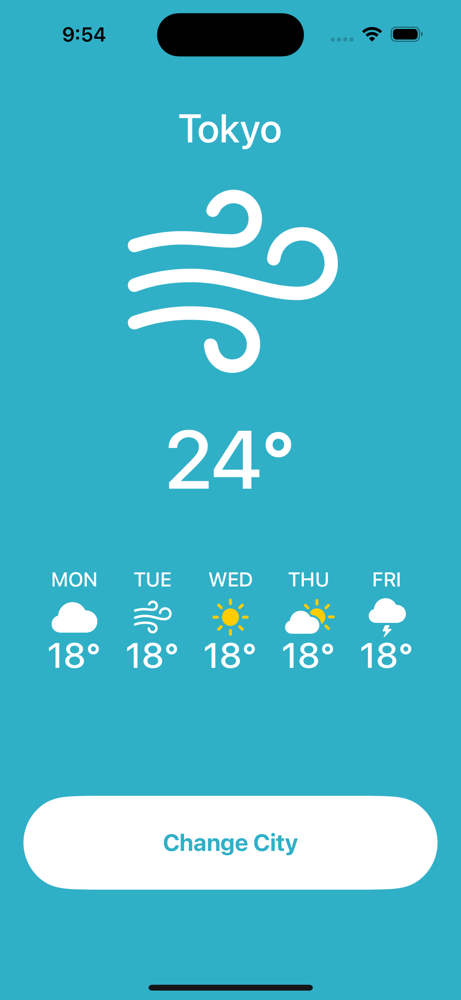
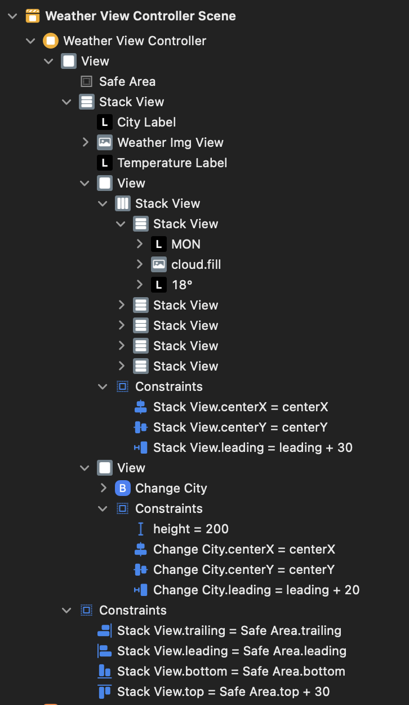

# SymbolRoller 프로젝트


1. UI 만들기
    - StackView - Vertical
        - Label
        - ImgView
        - Label
        - StackView - Horizontal
            - Label
            - ImgView
            - Label
        - Btn
2. 버튼 동작 넣기
    - Change City 버튼 클릭시
    - Label 변경
    - ImgView 변경

## UI 만들기(StoryBoard)
1. Stack View - Vertical(전체) 만들기
2. Stack View 안에 Label, ImgView, Label, StackView - Horizontal(주차), Btn 순서대로 넣기
3. Auto Layout 설정하기
4. StackView - Horizontal 만들기 - Label, ImgView, Label 순서대로 넣기 (5개)
5. Auto Layout 설정하기


### 최종 결과 StoryBoard!


## 버튼 동작 넣기(ViewController)
1. 각 UI들 들고오기
```
@IBOutlet weak var cityLabel: UILabel!
@IBOutlet weak var weatherImgView: UIImageView!
@IBOutlet weak var temperatureLabel: UILabel!
```

2. 바껴야할 Symbol들 List 만들어 놓기
```    
let cities = ["Seoul", "Tokyo", "LA", "Seattle"]
let weathers = ["cloud.fill", "sun.max.fill", "wind", "cloud.sun.rain.fill"]  
```

3. 버튼 누르면 동작할 함수 만들기
```
@IBAction func changeButtonTapped(_ sender: Any) {
    cityLabel.text = cities.randomElement()

    // list 이용해서 이미지 변경해주기
    // .withRenderingMode를 통해서 이미지 색상 및 모드 설정 
    let imageName = weathers.randomElement()
    weatherImgView.image = UIImage(systemName: imageName!)?.withRenderingMode(.alwaysOriginal)
    
    //random 이용해서 10°C에서 30°C로 만들기
    let randomTemp = Int.random(in: 10..<30)
    temperatureLabel.text = "\(randomTemp)°C"

    print("도시, 온도, 날씨 이미지 변경하기!")
}
```

## 전체 코드
[StoryBoard](https://github.com/alstjr7437/IosFirstStudy/blob/main/SimpleWeather/SimpleWeather/Base.lproj/Main.storyboard)
[ViewController](https://github.com/alstjr7437/IosFirstStudy/blob/main/SimpleWeather/SimpleWeather/WeatherViewController.swift)