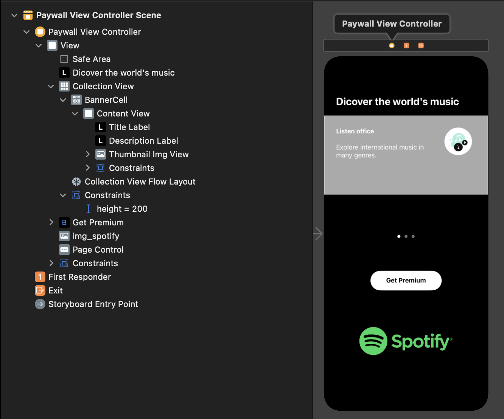
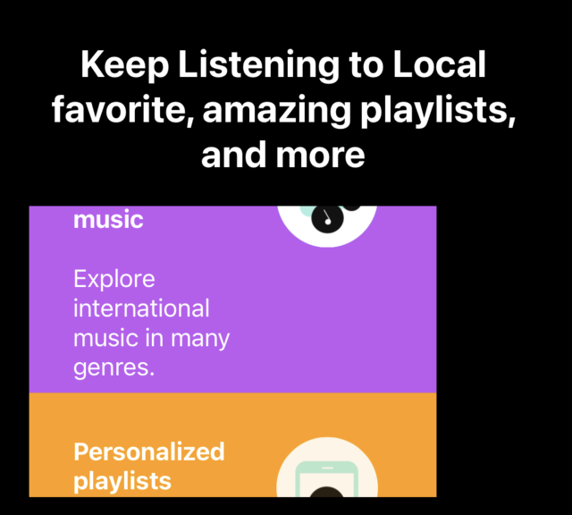
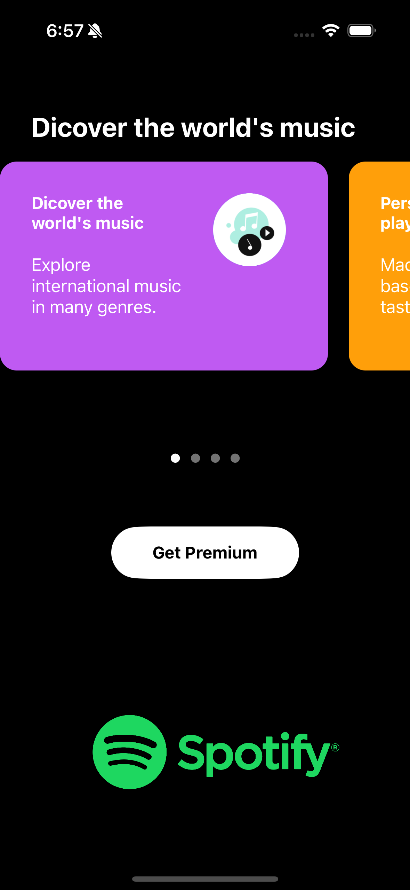
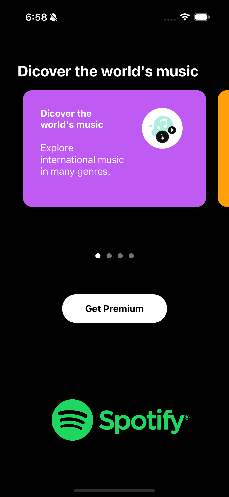
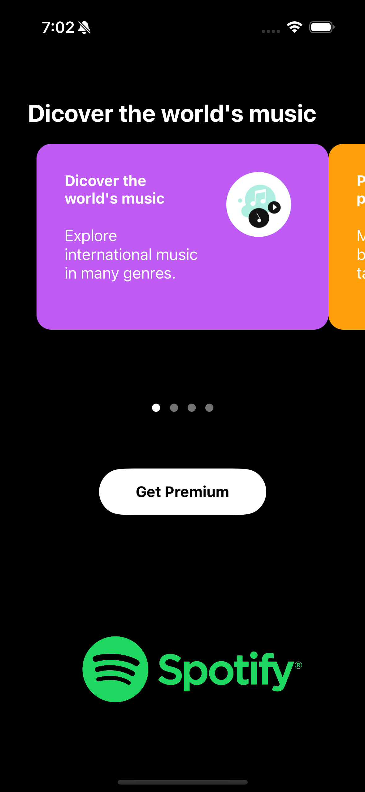
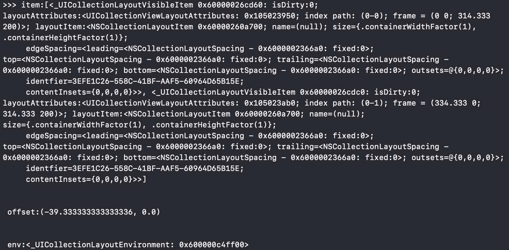

<!-- 무슨 프로젝트를 하고 무슨 기술을 사용했는지-->
# 스포티파이 구매뷰 프로젝트
# 사용 기술
- StoryBoard 
    - CollectionView 사용
    - Button 사용
    - PageControl 사용

- ViewController
    - CollectionView : DiffableDataSource 사용
    - DiffableDataSource 사용 - Presentation 부분
    - snapshot 사용 - Data 부분
    - CompositionalLayout - Layout 부분
    - visibleItemsInvalidationHandler - PageControl 부분

- CollectionViewCell(Result, Home)
    - configure : Cell 데이터 셋팅
    - awakeFromNib : 각 셀 생김새 설정

 

<br><br><br>

<!-- 이번 프로젝트 작업의 순서가 어떻게 되었는지-->
# 작업 순서

1. UI 만들기
    - Collection View
        - Banner Cell
            - ContentView
                - Title Label - 제목
                - Description Label - 내용
                - ThumnailImgView - 썸네일 이미지
    - Page Control - collection view에 따른 page Control
    - Get Premium Button - 구매 버튼(따로 기능X)
    - img_spotify - spotify 이미지

2. CollectionView 연결
    - datasource : UICollectionViewDiffableDataSource 작성
    - snapshot : NSDiffableDataSourceSnapshot 작성
    - Layout : UICollectionViewCompositionalLayout 작성
        - section, group, item 작성
        - section.orthogonalScrollingBehavior - 페이징으로 넘겨주기
        - section.interGroupSpacing - section당 거리 두기
        - section.visibleItemsInvalidationHandler - section 변경시 index 등
3. CollectionView Cell 데이터 업로드
    - UIComponent 연결
    - UIComponent 데이터 업로드 코드 작성

<br><br><br>

<!-- 최종 StoryBoard가 어떻게 생겼는지 캡쳐-->
# 최종 결과 StoryBoard


<br><br><br>

<!-- 배워간 부분을 하나씩 제목1로 작성-->
# Section 세부 수정하기

## 1. 짜잘한 Layout 수정하기
### 각 카드에 맞는 색깔 설정하기
Cell에 따른 background 색상 변경하기
```swift
// viewDidLoad 부분
cell.configure(item)
cell.backgroundColor = self.colors[indexPath.item]
```


### 세로로 스크롤이 아닌 가로 스크롤 만들기

 

group에 Layout 부분을 horizontal로 줘서 가로 스크롤
그리고 구매뷰는 section의 가로와 group의 가로가 같은 사이즈라 수평으로 scroll하기에는 작아서<br>
밑으로 밀리니까 section 코드도 추가하기
```swift 
// Layout 함수 부분
let group = NSCollectionLayoutGroup.horizontal(layoutSize: groupSize, subitems: [item])

section.orthogonalScrollingBehavior = .continuous

// viewDidLoad 부분
// 가로 스크롤 안되게 막기(안하면 세로로 해도 가로가 짧게 됨)
collectionView.alwaysBounceVertical = false
```

<br><br>

## 1. section.orthogonalScrollingBehavior

section의 Scroll을 설정하는 부분
groupPaging으로 줘서 paging느낌으로 하게 함

 
1. groupPaging - 화면에 맞게 쭉 채움(왼쪽)
2. groupPagingCentered - 화면의 중간에 오도록(오른쪽)
```swift
// ViewControll의 layout 부분
private func layout() ->UICollectionViewCompositionalLayout{
    let section = NSCollectionLayoutSection(group: group)
    // section.orthogonalScrollingBehavior = .groupPaging
    section.orthogonalScrollingBehavior = .groupPagingCentered
    return layout
}
```

<br><br>

## 2. interGroupSpacing 
group Spacing을 줘서 각 카드의 공간을 띄어줌

  

```swift
private func layout() ->UICollectionViewCompositionalLayout{
    let section = NSCollectionLayoutSection(group: group)
    section.interGroupSpacing = 20
    return layout
}
```

<br><br>

## 3. visibleItemsInvalidationHandler
[참고 사이트](https://medium.com/@kyuchul2/ios-compositional-layout%EC%9D%98-visibleitemsinvalidationhandler-%ED%99%9C%EC%9A%A9-190cde90c933)

#### section 표시한 아이템을 감지하고 관리할 수 있게 도와주는 API<br>

Item, offset, env를 리턴하고 있음

1. Item - 배열로 되어있음, 현재 표시된 아이템들을 보여줌
2. offset - 스크롤 Offset을 제공
3. env - 레이아웃의 컨테이너 및 환경 특성에 대한 정보를 제공하는 데 사용되는 프로토콜


#### 이번 프로젝트 사용 방식 
1. Offset --> cell의 겉 테두리 / ContentSize의 너비
2. 1번과 같이 하면 float형식으로 나옴
3. Int에 rounded(.up)으로 반올림 하여서 페이지 번호 설정!!!
4. PageControl의 currentPage를 계산한 Index로 설정!!!

```swift
private func layout() ->UICollectionViewCompositionalLayout{
    let section = NSCollectionLayoutSection(group: group)
    
    section.visibleItemsInvalidationHandler = { (item, offset, env) in
    
        // print(">>> item:\(item) \n\n\n offset:\(offset)\n\n\n env:\(env)")
        // print(env.container.contentSize)

        let index = Int((offset.x / env.container.contentSize.width).rounded(.up))
        print(index)
        self.pageControl.currentPage = index

    }

    return layout
}
```

<br><br><br>
<!-- 마무리 정리로 어떤 부분을 알아갔는지 적기-->
# 💡 알아간 부분
1. CompositionalLayout을 이용한 PageControl 부분
    - 예전에 배운 Datasource 보다 훨씬 간편하게 작성이 가능했다.
2. CompositionalLayout 가로 스크롤 구현 부분

<!-- 해당 코드가 저장된 GIT 적기-->
# 💻 전체 코드
[StoryBoard](https://github.com/alstjr7437/IosFirstStudy/blob/main/SpotifyPaywall/SpotifyPaywall/Base.lproj/Main.storyboard)<br>
[OnboardingViewController](https://github.com/alstjr7437/IosFirstStudy/blob/main/SpotifyPaywall/SpotifyPaywall/PaywalViewController.swift)<br>
[OnboardingCell](https://github.com/alstjr7437/IosFirstStudy/blob/main/SpotifyPaywall/SpotifyPaywall/BannerCell.swift)
