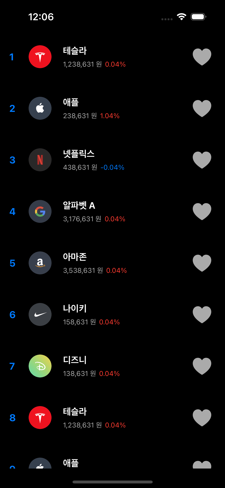
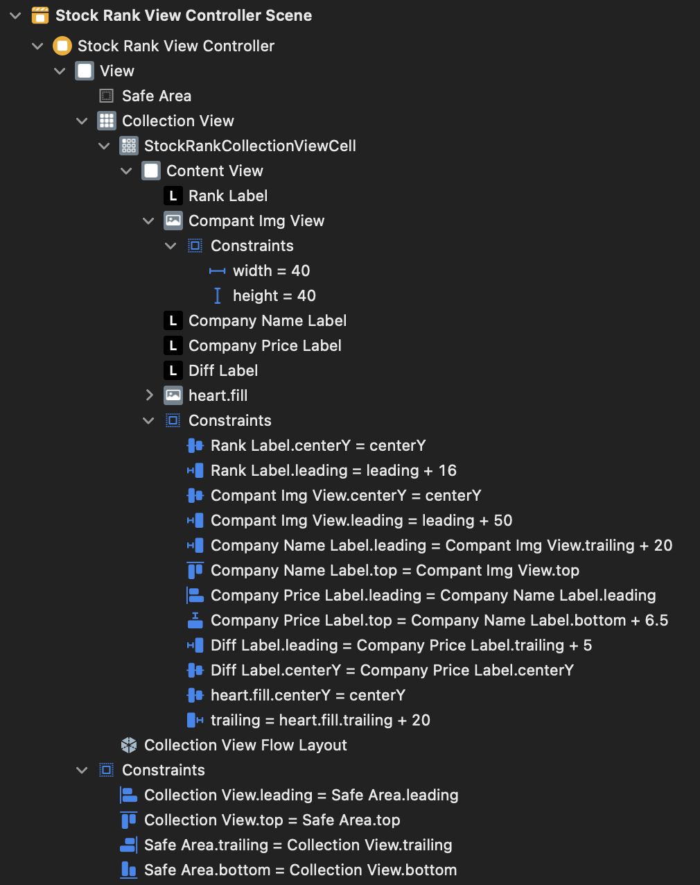

# StockRank 프로젝트
# 사용 기술
- StoryBoard 
    - CollectionView 사용
    - Auto Layout 설정

- ViewController
    - CollectionView : DataSource, Delegate 사용(self로 extension 사용)
    - extension DataSource : 데이터 셋팅(casting 사용)
    - extension DelegateFlowLayout : CGSize 설정

- CollectionViewCell
    - configure : 데이터 셋팅
    - DateFormatter : numberFormatter 이용해서 1000원 단위 콤마(,) 추가



[CollectionView 참고 사이트](https://ios-development.tistory.com/103)

0. StockModel 구조체 및 assets 파일 가져오기
    - rank, 회사 사진, 회사 이름, 가격, 변동률 가져오기
    - assets에 있는 로고들 들고오기
1. UI 만들기
    - Collection View
        - StockRankCollectionViewCell
            - ContentView
                - Label - rank
                - ImgView - 회사 로고
                - Label - 회사 이름
                - Label - 가격
                - Label - 변동률
                - ImgView - 하트
2. CollectionView 연결
    - Data -> 어떤 데이터?
    - Presentation -> 셀을 어떻게 표현?
    - Layout -> 셀을 어떻게 배치?
3. CollectionView 데이터 업로드
    - UIComponent 연결
    - UIComponent 데이터 업로드 코드 작성
4. 짜잘한 UI 코드 수정
    - 숫자 가독성을 위한 , 추가
    - -가 나오면 파란색으로

<br><br><br>

# UI 만들기(StoryBoard)
1. Collection View 만들기
2. Collection View안에 Cell 만들기(복사될)
3. Label 및 여러가지 필요한 UI 넣기
4. 각 UI에 맞는 AutoLayout 설정
    - ctrl으로 상위의 UI에 연결해서 위 맞추기 등

## 최종 결과 StoryBoard


# StockRankViewController 작성 
## 1. collectionView 가져오기
```Swift
@IBOutlet weak var collectionView: UICollectionView!
```

## 2. 데이터 구조체 가져오기
```Swift
let stockList:[StockModel] = StockModel.list
```

## 3. collectionView에 필요한 객체 가져오기
```Swift
override func viewDidLoad() {
    super.viewDidLoad()
    
    // dataSource는 앱이 보여주는 컨텐츠 그 자체
    // delegate는 대행자 collectionView가 ViewController에게 일 시키기

    // Delegate & Data source 세팅하기 -> extension을 통해 아래에서 구현함
    collectionView.dataSource = self
    collectionView.delegate = self
}
```

## 4. DataSource extension 작성
데이터 처리해서 넣어주는 부분
```Swift
//Presentation 부분
extension StockRankViewController: UICollectionViewDataSource{
    func collectionView(_ collectionView: UICollectionView, numberOfItemsInSection section: Int) -> Int {
        return stockList.count
    }
    
    func collectionView(_ collectionView: UICollectionView, cellForItemAt indexPath: IndexPath) -> UICollectionViewCell {
       
        // 혹시 StockRankCollectionViewCell 인지 물어보고 casting 안되면 UICollectionViewCell()
        // casting 되면 데이터 업데이트 해서 cell 동작
        guard let cell = collectionView.dequeueReusableCell(withReuseIdentifier: "StockRankCollectionViewCell", for: indexPath) as? StockRankCollectionViewCell else {
            return UICollectionViewCell()
        }
        
        let stock = stockList[indexPath.item]
        cell.configure(stock)
        
        return cell
    }   
}
```
## Casting 부분
```
?는 캐스팅 한거 실패시 else 동작

남자 사람
남자 : 사람

let joon = Namja()
let joon = Saram()

준이 남자인지 물어보는거
joon as? Namja

gaurd let nam = joon as? Namja else{
    군대 X
    return
}
군대 O
```


gaurd <꼭 참이어야 하는 조건> else{
    return ~~~
}
"""

## 5. DelegateFlowLayout extension 작성
CollectionView Cell 크기 수정
```Swift
extension StockRankViewController: UICollectionViewDelegateFlowLayout{
    func collectionView(_ collectionView: UICollectionView, layout collectionViewLayout: UICollectionViewLayout, sizeForItemAt indexPath: IndexPath) -> CGSize {
        // width == collectionview
        // 80
        
        return CGSize(width: collectionView.bounds.width, height: 80)
        
    }
}
```

<br><br><br>

# StockRankCollectionViewCell 작성
## 1. UIComponent 연결
1. Storyboard에서 CollectionViewCell에 가서 우측의 class및 Identifier 수정
2. 클릭하여 Assistant의 코드 부분을 StockRankCollectionViewCell로 변경
3. ctrl로 Label 및 ImgView 끌고오기
```Swift
@IBOutlet weak var rankLabel: UILabel!
@IBOutlet weak var compantImgView: UIImageView!
@IBOutlet weak var companyNameLabel: UILabel!
@IBOutlet weak var companyPriceLabel: UILabel!
@IBOutlet weak var diffLabel: UILabel!
```

## 2. UIComponent 데이터 업로드 코드 작성
함수를 만들어 데이터 업로드 코드 작성<br>
diff 부분에 삼항 연산자를 통해 변동률이 음수면 TextColor가 파란색으로
```Swift
func configure(_ stock: StockModel){
    rankLabel.text = "\(stock.rank)"
    compantImgView.image = UIImage(named: stock.imageName)
    companyNameLabel.text = "\(stock.name)"
    companyPriceLabel.text = "\(convertToCurrencyFormat(price: stock.price)) 원"
    
    diffLabel.textColor = stock.diff > 0 ? UIColor.systemRed : UIColor.systemBlue
    diffLabel.text = "\(stock.diff)%"
}
```

## 3. 숫자 가독성 위한 함수 추가
numberFormatter을 이용한 1000원 단위 콤마(,) 추가
```Swift
func convertToCurrencyFormat(price: Int) -> String{
    let numberFormatter = NumberFormatter()
    numberFormatter.numberStyle = .decimal
    numberFormatter.maximumFractionDigits = 0

    let result = numberFormatter.string(from: NSNumber(value: price)) ?? ""
    return result
}
```

<br><br><br>

# 💡 알아간 부분
1. collectionView 첫 연습
2. NumberFormatter을 이용한 숫자 형식 수정
3. 삼항 연산자를 통한 컬러 변경
4. casting을 통한 셀 그리기

# [전체 코드](https://github.com/alstjr7437/IosFirstStudy/tree/main/StockRank/StockRank)
[StoryBoard](https://github.com/alstjr7437/IosFirstStudy/blob/main/StockRank/StockRank/Base.lproj/Main.storyboard)<br>
[ViewController](https://github.com/alstjr7437/IosFirstStudy/blob/main/StockRank/StockRank/StockRankViewController.swift)<br>
[CollectionViewCell](https://github.com/alstjr7437/IosFirstStudy/blob/main/StockRank/StockRank/StockRankCollectionViewCell.swift)