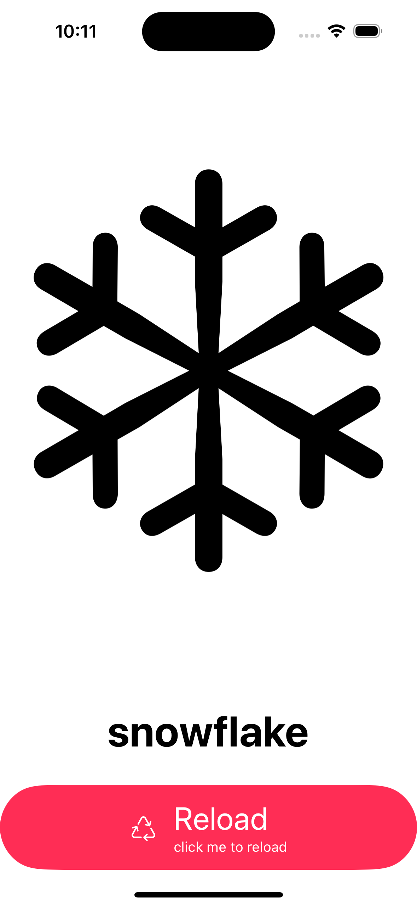
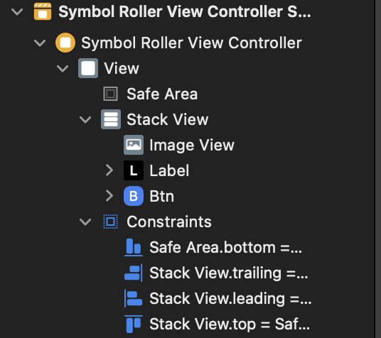
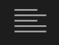

# SymbolRoller 프로젝트
### AutoLayout, ButtonAction 연습


1. UI 만들기
    - StackView - Vertical
        - ImgView
        - Label
        - Btn
2. 버튼 동작 넣기
    - Reload 버튼 클릭시
    - 이미지 변경
    - Label 변경

## UI 만들기(StoryBoard)
1. Stack View 만들기
2. Stack View 안에 ImgView, Label, Btn 순서대로 넣기
3. Stack View Auto Layout 설정하기
4. Label, Btn에 Height 설정하기

### 최종 결과 StoryBoard


## 버튼 동작 넣기(ViewController)
하는 방법 : Storyboard에서 오른쪽 상단  클릭하여 Assistant 클릭<br>
ViewController가 나오면 해당 부분에 필요한 UI ctrl 눌러서 들고오기<br>
imgView와 Label은 그냥 들고오고 Btn은 IBOutlet과 Action으로 들고오기

1. 각 UI들 들고오기
```
@IBOutlet weak var imageView: UIImageView!
@IBOutlet weak var label: UILabel!
@IBOutlet weak var btn: UIButton!
```

2. 바껴야할 Symbol들 List 만들어 놓기
```
let symbols: [String] = ["sun.min", "moon", "cloud", "wind", "snowflake"]
```

3. 처음 Load시 만들어질 이미지 viewDidLoad에 넣기
```
override func viewDidLoad() {
    super.viewDidLoad()
    
    print(reload(), "로 생성")

    //button 생성시 색깔 변경
    btn.tintColor = UIColor.systemPink
}
```

4. 이미지가 바뀌는 동작을 하는 함수 만들기
```
func reload() -> String {
    let symbol = symbols.randomElement()!
    imageView.image = UIImage(systemName: symbol)
    label.text = symbol
    
    return symbol
}
```

5. 버튼 누르면 동작할 함수 만들기
```
@IBAction func btnTap(_ sender: Any) {
    print(reload(),"바꿈")
}
```

## 전체 코드
[StoryBoard](https://github.com/alstjr7437/IosFirstStudy/blob/main/SybolRoller/SymbolRoller/Base.lproj/Main.storyboard)<br>
[ViewController](https://github.com/alstjr7437/IosFirstStudy/blob/main/SybolRoller/SymbolRoller/SymbolRollerViewController.swift)