# Diffable Data Source
## 💡 Diffable Data Source?
> TableView(또는 CollectionView)를 그리기 위한 데이터를 관리하고 UI를 업데이트 하는 역할을 한다. <br>Data Source 와 달리 데이터가 달라진 부분을 추적하여 자연스럽게 UI를 업데이트한다.

Data source -> Protocol<br>
Diffable Data source -> Generic 

### Data Source?
> DataSource에는 <br>1. UITableViewDataSource <br> 2. UICollectionViewDataSource <br>

> Diffable Data Sourced에는 <br>1. UITableViewDiffableDataSource <br> 2. UICollectionViewDiffableDataSource

UITableViewDiffableDataSource가 UITableViewDataSource를 conform하고 있음. 

<br><br><br>
# 💡 사용 이유?
 WWDC_2019 [Adbaces in UI Data Source](https://developer.apple.com/videos/play/wwdc2019/220/)에서 설명

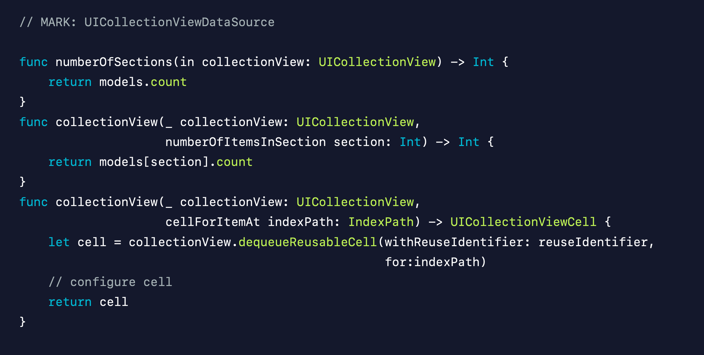
위와 같은 구조가 

> ### 기존 DataSource <br>
> 1. 간단하여 빠르게 작성 가능, 유연한 구조
> 2. 보통 <b>Controller가 데이터 받아</b>와서 <b>UI에게 변경</b> 알림
> 3. 점점 복잡한 구현이 생기면서, 기존 방식 사용시 이슈 생기는게 많아짐
> 4. <b>Controller와 UI가 들고 있는 데이터 불일치</b> 발생
>    - 앱에서 어느것이 더 맞는 데이터인지 판단하기 어려움

<br>

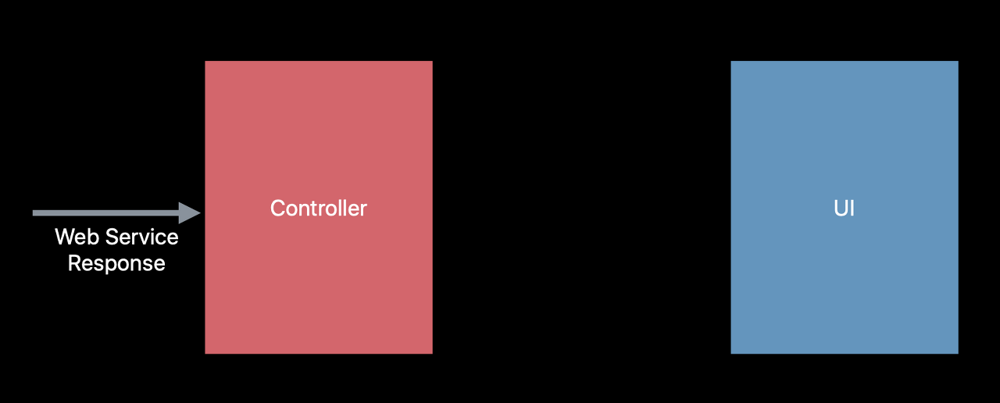 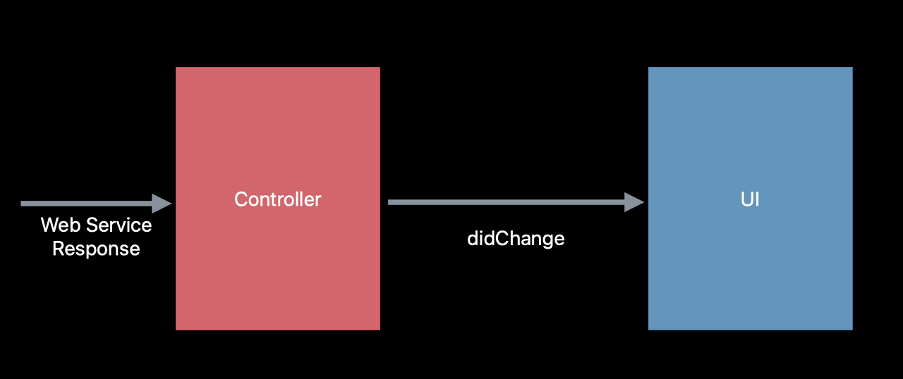

위와 같이 Controller가 웹 서비스 요청 받고 UI에게 내가 바뀌었다고 말함

그렇게 진행하다가 아래와 같은 에러 발생

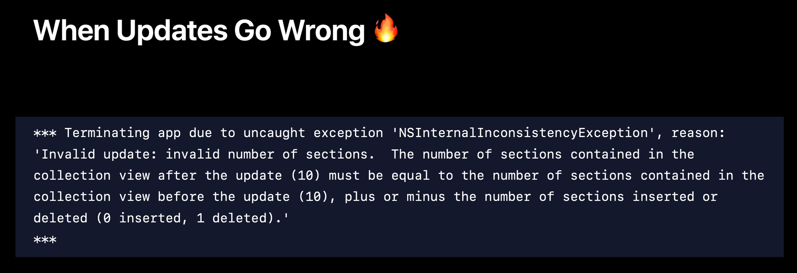

### 위 같은 현상이 일어나는 이유
DataSource 역할을 하는 Data Controller가 <br>
시간이 지남에 따라 변하는 자기 자신만의 버전인 truth를 가지고 있음.(own version of the truth)<br>
UI역시 truth를 가지고 있음<br>
이 truth들끼리 서로 안맞으면 위 에러 발생<br>
-> centralize된 truth가 없기 때문입니다.


### ❗️ reloadDate를 사용하면 되지 않나?
> reloadData를 사용하면 해결은 되지만 <b>대신 애니메이션되지 않은 효과가 나타남</b>

<br><br><br>

# 💡 Single Source Of Truth Data의 필요성 증가
- 기존의 구현 방식에서 어떤 데이터(Controller, UI)가 참인지 알기 어려웟음
- 따라서, 근본적인 문제 해결 방식 --> 데이터를 한개만 두도록 함 --> Single Source of Truth
- 그렇게 해서 제안된 방법이 Diffable Datasource

Diffable DataSource에는 performBatchUpdates따위것들이 없습니다.<br>
Crash나 번거로움, 복잡성, 처리하고 싶지 않은 모든 것들이 없고, apply라는 단일 메소드가 있습니다. 
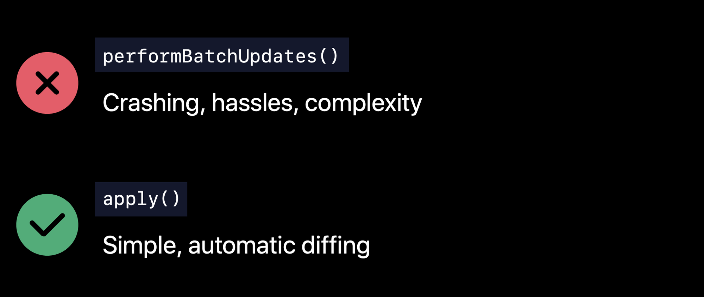

<br><br><br>

# 💡 Snapshot
간단히 말해 현재 UI state의 truth
- 한가지 참인 데이터를 관리하는 객체
- IndexPath를 쓰지 않음
- 섹션 및 아이템에 대해서 Unique ID를 사용
    - Unique + Hashable
    - 구현 예)
    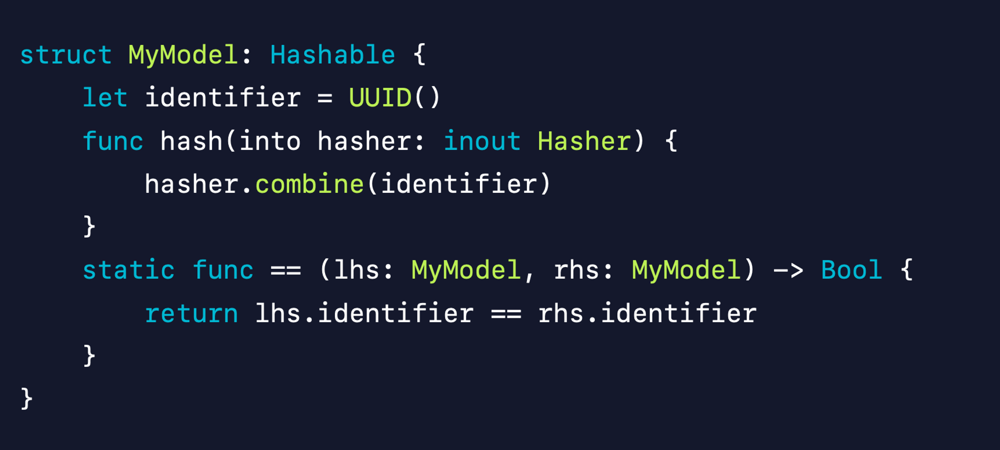

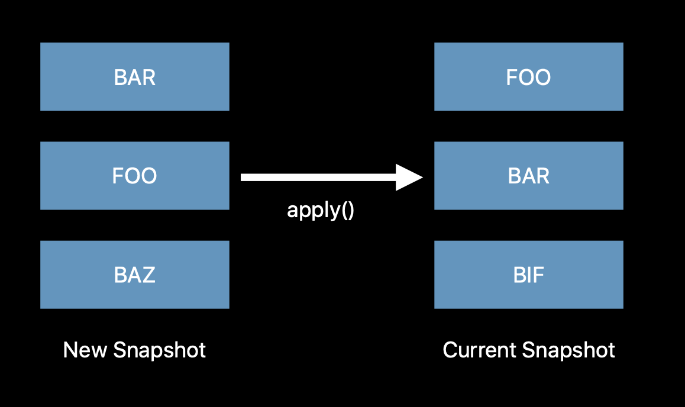 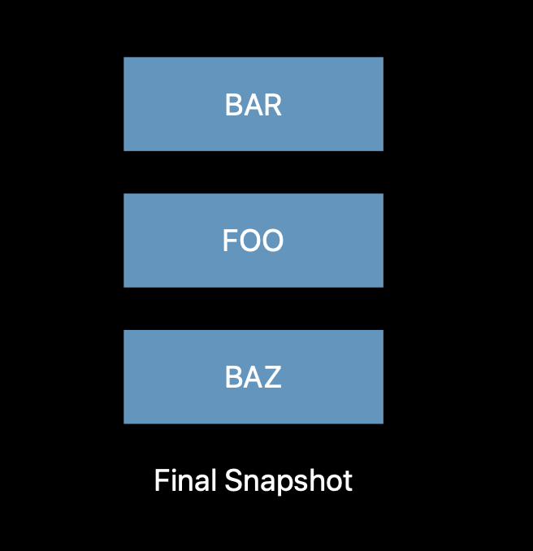

<br><br><br>

# 💡 Layout 이슈
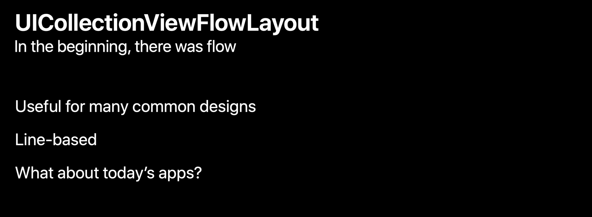
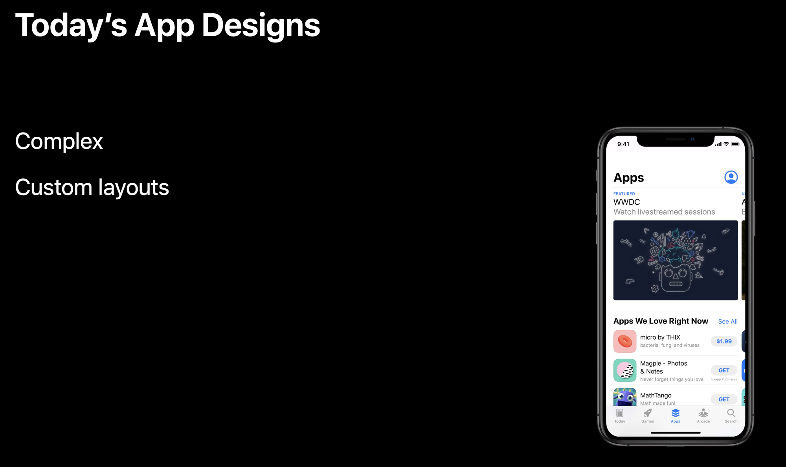

기존의 UICollectionViewFlowLayout -> 대부분의 단순 디자인에서는 좋은 역할<br>
다만, 점점 복잡한 디자인이 되었을때 -> CustomLayout을 그때마다 구현해줘야햇음,.

## Compositional Layout 의 등장
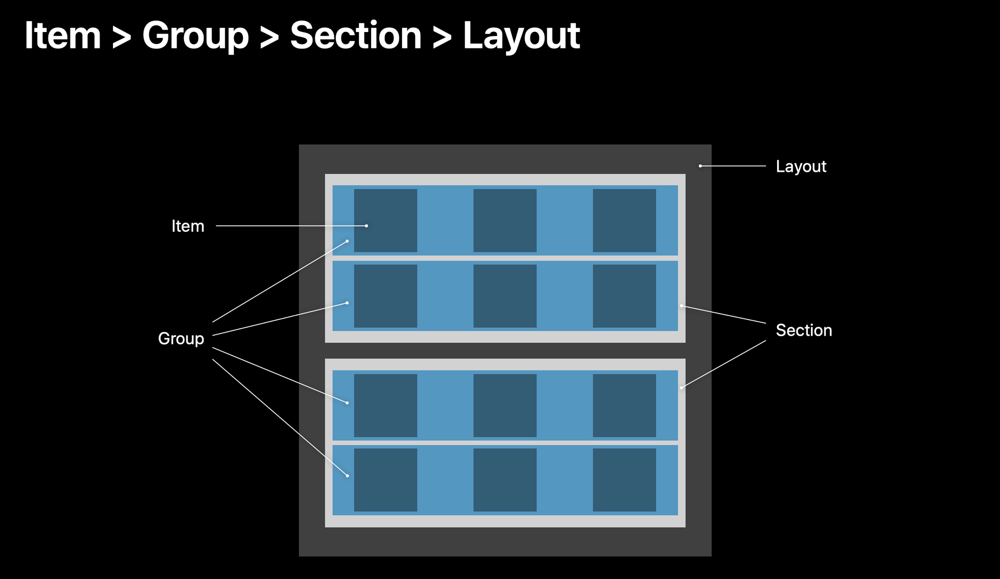

코드로 보면

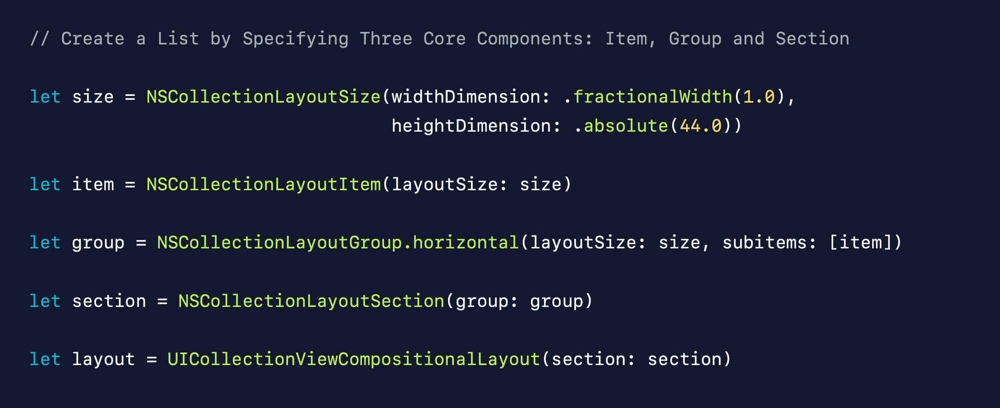

<br><br><br>

# 예시 프로젝트
Study에 있는 [AppleFramework](https://github.com/alstjr7437/TIL/blob/main/Swift/Uikit/Study/AppleFramework/AppleFramework.md)을 기존 DataSource에서 Diffable로 바꿔보기

## 📊 DataSource 부분
Controller를 통한 UI 변경 알림
```swift
extension FrameworkListViewController: UICollectionViewDataSource{

    // ✅ 각 section 의 아이템 갯수 제공.
    func collectionView(_ collectionView: UICollectionView, numberOfItemsInSection section: Int) -> Int {
        return list.count
    }
    
    // ✅ 각 행에 대한 셀 제공.
    func collectionView(_ collectionView: UICollectionView, cellForItemAt indexPath: IndexPath) -> UICollectionViewCell {
        guard let cell = collectionView.dequeueReusableCell(withReuseIdentifier: "FrameworkCell", for: indexPath) as? FrameworkCell else {
            return UICollectionViewCell()
        }
        let framework = list[indexPath.item]
        cell.configure(framework)
        return cell
    }
}
```

### Diffable Data Source으로 작성한 코드
Presentation 부분<br>
```swift
// ViewController의 viewDidLoad 부분
dataSoutce = UICollectionViewDiffableDataSource<Section, Item>(collectionView: collectionView, cellProvider: { collectionView, indexPath, itemIdentifier in
    guard let cell = collectionView.dequeueReusableCell(withReuseIdentifier: "FrameworkCell", for: indexPath) as? FrameworkCell else {
        return nil
    }
    
    cell.configure(itemIdentifier)
    return cell
})
```

Data 부분
snapshot을 이용
```swift
// ViewController의 viewDidLoad 부분
var snapshot = NSDiffableDataSourceSnapshot<Section, Item>()
snapshot.appendSections([.main])
snapshot.appendItems(list, toSection: .main)
dataSoutce.apply(snapshot)
```

<br><br><br>

## ✏️ Layout 부분
### 기존 FlowLayout 작성 코드
```swift
extension FrameworkListViewController: UICollectionViewDelegateFlowLayout{
    func collectionView(_ collectionView: UICollectionView, layout collectionViewLayout: UICollectionViewLayout, sizeForItemAt indexPath: IndexPath) -> CGSize {
        
        // 여백 주기
        let interItemSpacing: CGFloat = 10
        let padding: CGFloat = 16
        let width = (collectionView.bounds.width - interItemSpacing * 2 - padding * 2) / 3
        let height = width * 1.5
        return CGSize(width: width, height: height)
    }
    
    //지정된 섹션의 셀 사이의 최소간격을 반환하는 메서드.
    func collectionView(_ collectionView: UICollectionView, layout collectionViewLayout: UICollectionViewLayout, minimumInteritemSpacingForSectionAt section: Int) -> CGFloat {
        return 10
    }
    //지정된 섹션의 행 사이 간격 최소 간격을 반환하는 메서드. scrollDirection이 horizontal이면 수직이 행이 되고 vertical이면 수평이 행이 된다.
    func collectionView(_ collectionView: UICollectionView, layout collectionViewLayout: UICollectionViewLayout, minimumLineSpacingForSectionAt section: Int) -> CGFloat {
        return 10
    }
}
```

### Compositional Layout으로 작성한 코드
```swift
    //Layout
    private func layout() -> UICollectionViewCompositionalLayout{
        // item 설정 부분
        let itemSize = NSCollectionLayoutSize(widthDimension: .fractionalWidth(0.33), heightDimension: .fractionalHeight(1))
        let item = NSCollectionLayoutItem(layoutSize: itemSize)
        
        // group 설정 부분
        let groupSize = NSCollectionLayoutSize(widthDimension: .fractionalWidth(1), heightDimension: .fractionalWidth(0.33))
        let group = NSCollectionLayoutGroup.horizontal(layoutSize: groupSize, subitem: item, count: 3)
        
        // section 설정 부분
        let section = NSCollectionLayoutSection(group: group)
        
        // layout 설정 부분
        let layout = UICollectionViewCompositionalLayout(section: section)
        return layout
    }
```

<br><br><br>

# ⚠️ 참고
바꾼 [AppleFramework](https://github.com/alstjr7437/IosFirstStudy/blob/main/AppleFramework_DiffableDatasource/AppleFramework/FrameworkListViewController.swift) 코드<br>
[ZeddiOS:티스토리](https://zeddios.tistory.com/1197) -> 예시 프로젝트 까지 있음!<br> 
[WWDC 2019 DataSource](https://developer.apple.com/videos/play/wwdc2019/220/)<br>
[WWDC 2019 Layout](https://developer.apple.com/videos/play/wwdc2019/215/)
