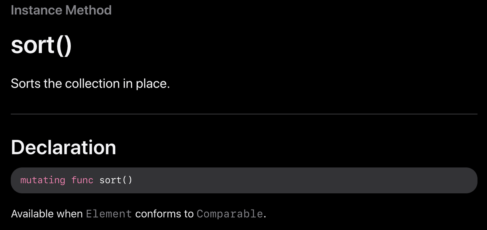
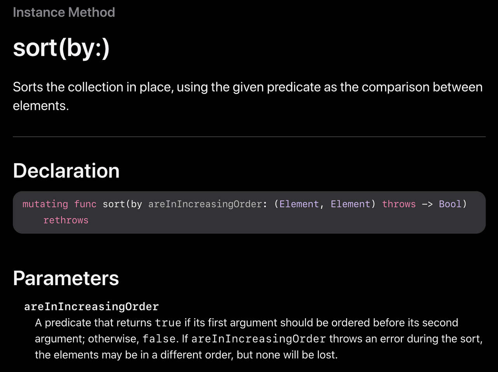
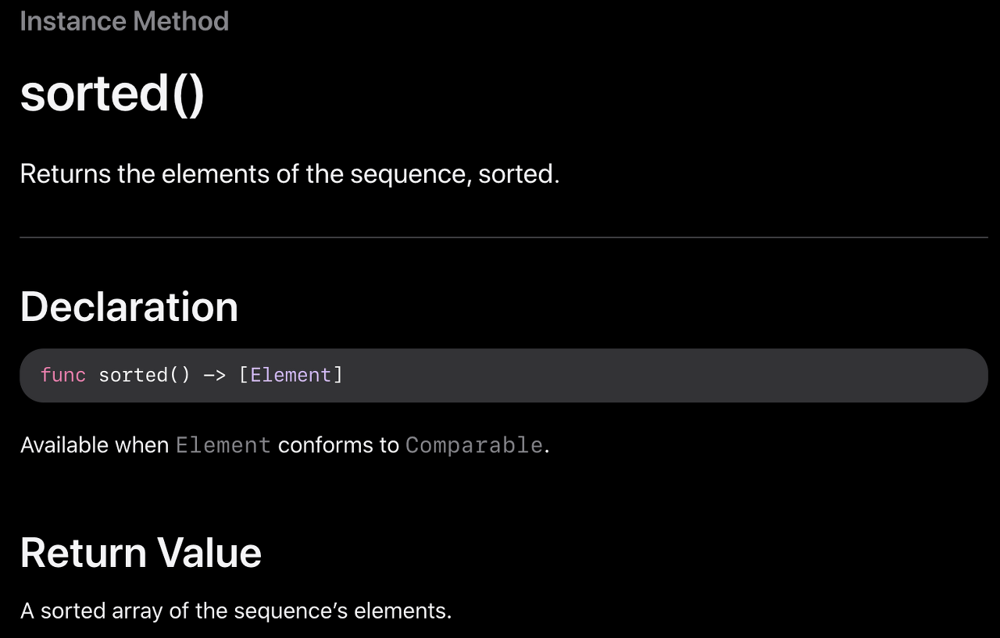
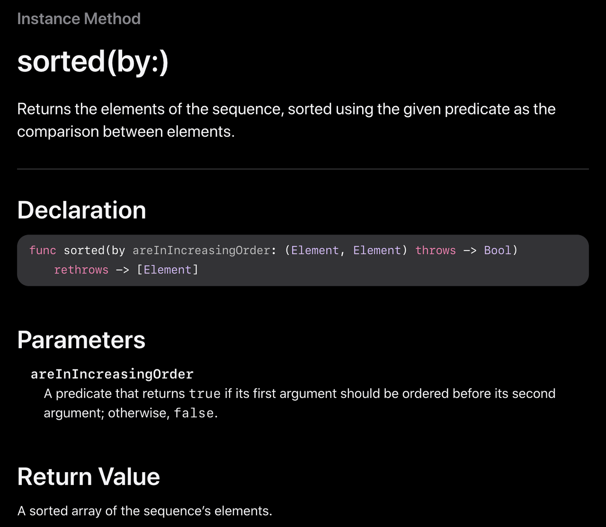

# Sort
## sort()

sort는 **원본 배열**을 가지고 **오름차순**으로 정렬<br>

sort()메서드는 **제자리에서**에서 정렬하기 때문에 반환값 없음

<br><br><br>

## sort(by:)

```우리가 원하는 방식의 정렬을 커스텀 해주고 싶을때!```<br><br>
by: 인자 뒤에 적은 조건에 따라서 두 원소를 비교해서<br>
sort() 메서드 처럼 제자리 정렬을 해주는 메서드 입니다.<br>
by: 부분은 클로저 형태로 되어 있음

내림차순 정렬 -> sort(by:>)<br>
오름차순 정렬 -> sort(by:<)(기본 sort)

```swift
var arr = [2, 12, 30, 15, 7]

// 기본 오름차순
arr.sort()
print(arr) // [2, 7, 12, 15, 30]

// 내림차순 (sort(by:) 사용)
arr.sort(by: >)
print(arr) // [30, 15, 12, 7, 2]
```
```swift 
names.sort { lhs, rhs in
  lhs < rhs
}
print(names) // ["apple", "break", "car", "drive", "ensure", "fast", "gear"]

names.sort(by: <)
print(names) // ["apple", "break", "car", "drive", "ensure", "fast", "gear"]
```

<br><br><br>

# Sorted
## sorted()

sort와 다르게 **원본 배열을 건드리지 않고** **사본**을 만들어서 오름차순 정렬<br>
sorted()메서드는 정렬한 원소들의 sequence를 리턴하여 주는 메서드라서 리턴값이 있음

```swift
names.sorted()
print(names) // ["break", "fast", "car", "apple", "drive", "ensure", "gear"]

names.sort()
print(names) // ["apple", "break", "car", "drive", "ensure", "fast", "gear"]

names = names.sorted()
print(names) // ["apple", "break", "car", "drive", "ensure", "fast", "gear"]
```

<br><br><br>

## sorted(by:)

sort(by:)와 sorted(by:) 의 차이점은 sort와 sorted의 차이점과 똑같음!!<br>
리턴값 차이!! 

```swift
var arr = [2, 12, 30, 15, 7]

// 기본 오름차순
var sortedArr = arr.sorted()
print(arr) // [2, 12, 30, 15, 7]
print(sortedArr) // [2, 7, 12, 15, 30]

// 내림차순 (sort(by:) 사용)
var sortedArr2 = arr.sorted(by: >)
print(sortedArr2) // [30, 15, 12, 7, 2]
```
<br><br><br>

# sort & sorted 차이, 주의점
### sort -> 원본 배열 자체의 순서 변경<br>
- 리턴값이 없음
- 기존의 배열 순서가 중요한 경우 sort를 쓰면 위험


### sorted -> 원본 배열의 사본을 만들어서 변경<br>
- 리턴값이 있음
- 사본을 만드는 만큼 메모리의 사용량이 2개가 됨

<br><br><br>

# ⭐️ sort & sorted 이용 예제!!
출석을 들어온 순서가 있고 이름이 있으면
```swift
var attendList: [String] = [] // 출석  순서 대로 추가할 배열
attendList.append("wang") // 1빠로 출석
attendList.append("kim") // 2빠로 출석
attendList.append("lee") // 3빠로 출석
attendList.append("park") // 4빠로 출석
```
sort를 통해 정렬시 누가 먼저 왔는지 없어지고 이름 순으로만 정렬이 되어버림
```swift
attendList.sort()
print(attendList) // ["kim", "lee", "park", "wang"]
```
sorted를 통해 정렬시 누가 먼저 온지와 이름순 두가지를 다 가질 수 있음!
```swift
var sortedList = attendList.sorted()

// 누가 먼저 온지
print(attendList) // ["wang", "kim", "lee", "park"]
// 이름 순 정렬
print(sortedList) // ["kim", "lee", "park", "wang"]
```


